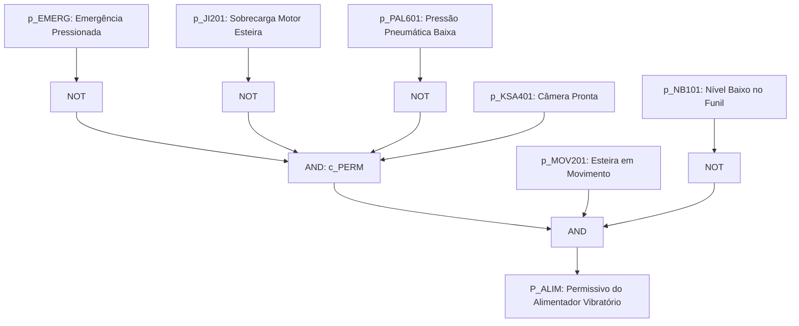
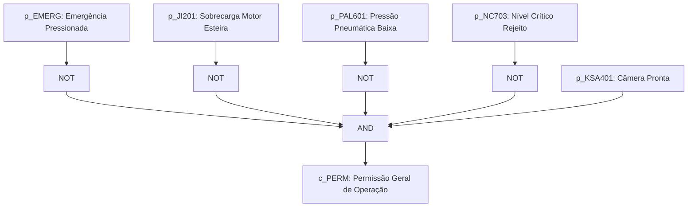
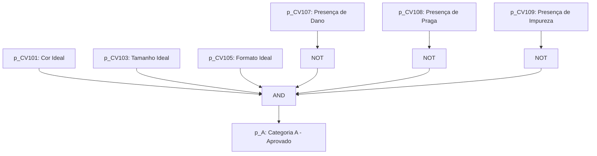
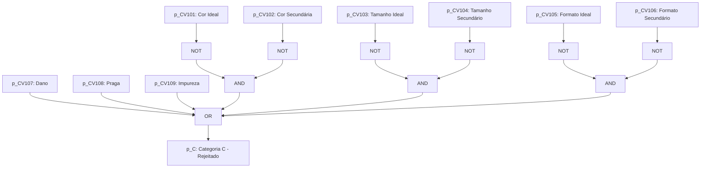
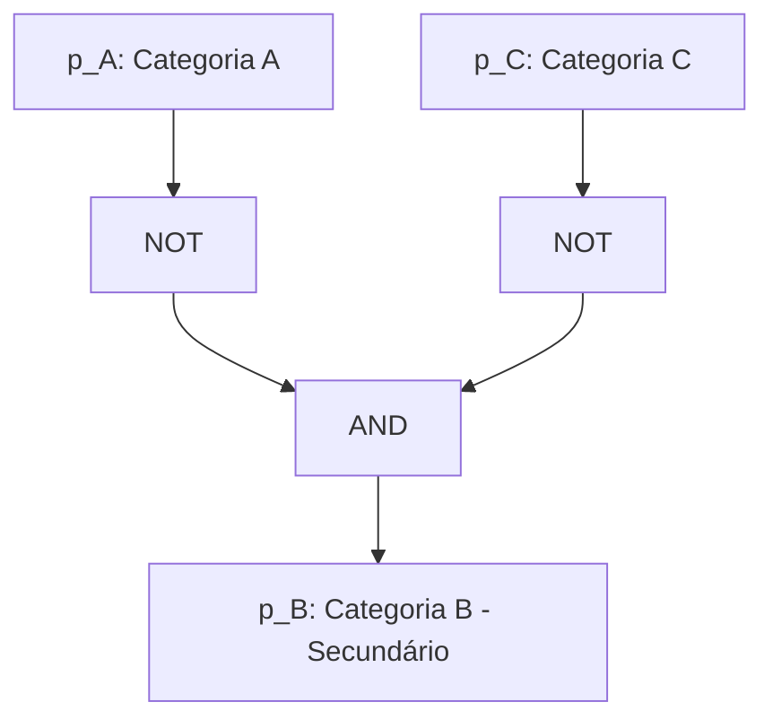
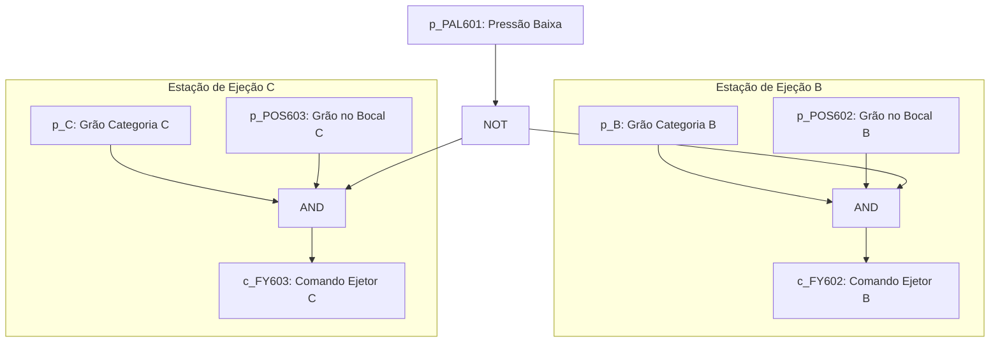

# Aula 04: Lógica Proposicional — Conectivos e Blocos de Permissivos

## 1. Fundamentos Matemáticos: Conectivos Lógicos

Na matemática discreta, uma **proposição** é uma sentença declarativa que assume um e apenas um valor-verdade: **Verdadeiro** ($1$) ou **Falso** ($0$).

As operações sobre variáveis proposicionais são definidas por operadores lógicos fundamentais:
1. **Negação ($\neg A$ ou $\bar{A}$):** Operação unária que complementa a proposição, invertendo seu estado lógico.
2. **Conjunção ($A \land B$):** Operação binária ativada unicamente quando ambos os operandos estão em nível alto ($1$). Em automação, modela condições em **série** (intertravamento e permissivos conjuntos).
3. **Disjunção ($A \lor B$):** Operação binária que resulta em valor verdadeiro se ao menos uma das entradas estiver ativa ($1$). Em automação, modela redundâncias ou condições em **paralelo** (múltiplas causas de falha).
4. **Disjunção Exclusiva ($A \oplus B$):** Operação que produz saída verdadeira quando as entradas possuem estados lógicos distintos.
5. **Implicação / Condicional ($A \rightarrow B$):** Operação que é falsa apenas quando o antecedente é verdadeiro e o consequente é falso. Modela regras operacionais "SE condição $A$, ENTÃO ação $B$".
6. **Bicondicional ($A \leftrightarrow B$):** Operação cuja saída é verdadeira somente quando ambos os operandos possuem o mesmo estado lógico. Modela equivalência de estados operacionais.

---

## 1.2. Tabelas-Verdade dos Operadores Lógicos

Abaixo estão as tabelas-verdade para cada um dos operadores lógicos apresentados em notação booleana/binária ($1$ / $0$).

### Negação ($\neg A$)

| $A$ | $\neg A$ |
| :---: | :---: |
| 1 | 0 |
| 0 | 1 |

---

### Conjunção ($A \land B$)

| $A$ | $B$ | $A \land B$ |
| :---: | :---: | :---: |
| 1 | 1 | 1 |
| 1 | 0 | 0 |
| 0 | 1 | 0 |
| 0 | 0 | 0 |

---

### Disjunção ($A \lor B$)

| $A$ | $B$ | $A \lor B$ |
| :---: | :---: | :---: |
| 1 | 1 | 1 |
| 1 | 0 | 1 |
| 0 | 1 | 1 |
| 0 | 0 | 0 |

---

### Disjunção Exclusiva ($A \oplus B$)

| $A$ | $B$ | $A \oplus B$ |
| :---: | :---: | :---: |
| 1 | 1 | 0 |
| 1 | 0 | 1 |
| 0 | 1 | 1 |
| 0 | 0 | 0 |

---

### Implicação / Condicional ($A \rightarrow B$)

> **Nota:** $A \rightarrow B \equiv \neg A \lor B$

| $A$ | $B$ | $A \rightarrow B$ |
| :---: | :---: | :---: |
| 1 | 1 | 1 |
| 1 | 0 | 0 |
| 0 | 1 | 1 |
| 0 | 0 | 1 |

---

### Bicondicional ($A \leftrightarrow B$)

> **Nota:** $A \leftrightarrow B \equiv (A \rightarrow B) \land (B \rightarrow A)$

| $A$ | $B$ | $A \leftrightarrow B$ |
| :---: | :---: | :---: |
| 1 | 1 | 1 |
| 1 | 0 | 0 |
| 0 | 1 | 0 |
| 0 | 0 | 1 |

## 2. Aplicação em Engenharia: Permissivos de Partida e Intertravamento do Alimentador Vibratório

Na Engenharia de Controle e Automação, o **permissivo de partida** é um conjunto de condições lógicas de segurança e de processo que devem ser integralmente satisfeitas para autorizar o acionamento inicial de um equipamento industrial. Uma vez em operação, essas e outras condições críticas continuam sendo monitoradas continuamente pelo CLP (Controlador Lógico Programável); caso alguma falhe, o **intertravamento de operação (*Run Interlock* / *Trip*)** é comutado, provocando a parada imediata e segura do sistema para evitar acidentes ou danos aos equipamentos.

---

### 2.1. Permissivo do Alimentador Vibratório ($P_{\text{ALIM}}$)

O Alimentador Vibratório é o equipamento responsável pela dosagem controlada e contínua dos grãos na esteira de transporte para posterior inspeção óptica. A partida segura do alimentador depende da liberação geral da planta, da confirmação de que a esteira transportadora está em movimento e da garantia de suprimento de grãos no funil de recepção (evitando a operação a seco).

Para permitir a partida do Alimentador Vibratório, as seguintes condições devem ser satisfeitas simultaneamente:
1. **Permissão Geral de Operação satisfeita** ($c_{\text{PERM}} = 1$): Sem botão de emergência acionado ($\neg p_{\text{EMERG}}$), sem sobrecarga no motor da esteira ($\neg p_{\text{JI201}}$), sem pressão pneumática baixa ($\neg p_{\text{PAL601}}$) e com a câmera de visão computacional pronta ($p_{\text{KSA401}}$).
2. **Esteira em movimento** ($p_{\text{MOV201}} = 1$): Confirmado pela medição de velocidade ($\text{ST-201} > 0$).
3. **Ausência de nível baixo no funil de recepção** ($\neg p_{\text{NB101}} = 1$): Garantido pelo comparador do transmissor de nível ($\text{LIT-101} \ge L_{\text{min}}$).

A expressão lógica formal que define o permissivo do Alimentador Vibratório é expressa por:

$$P_{\text{ALIM}} \equiv (\neg p_{\text{EMERG}} \land \neg p_{\text{JI201}} \land \neg p_{\text{PAL601}} \land p_{\text{KSA401}}) \land p_{\text{MOV201}} \land \neg p_{\text{NB101}}$$

### 2.2. Permissão Geral de Operação ($c_{\text{PERM}}$)

A Permissão Geral de Operação é o sinal mestre de habilitação do processo SCADA/CLP. A planta só é liberada para operar se não houver condição de emergência, se os sistemas elétricos e pneumáticos estiverem normais, se o reservatório de rejeitos não estiver transbordando e se a câmera de visão computacional estiver pronta.

Para autorizar a Permissão Geral ($c_{\text{PERM}} = 1$), as seguintes condições de segurança e processo devem ser satisfeitas simultaneamente:
1. **Ausência de emergência acionada** ($\neg p_{\text{EMERG}} = 1$);
2. **Ausência de sobrecarga no motor da esteira** ($\neg p_{\text{JI201}} = 1$);
3. **Pressão pneumática normal** ($\neg p_{\text{PAL601}} = 1$);
4. **Reservatório de rejeito sem bloqueio por nível crítico** ($\neg p_{\text{NC703}} = 1$);
5. **Câmera de visão computacional operacional** ($p_{\text{KSA401}} = 1$).

A expressão lógica formal da Permissão Geral de Operação consolidada é dada por:

$$c_{\text{PERM}} \equiv \neg p_{\text{EMERG}} \land \neg p_{\text{JI201}} \land \neg p_{\text{PAL601}} \land \neg p_{\text{NC703}} \land p_{\text{KSA401}}$$

---

### 2.3. Classificação Lógica dos Grãos (Categorias A, B e C)

O sistema de visão computacional analisa os atributos físicos dos grãos e disponibiliza os sinais digitais no CLP para a tomada de decisão em tempo real.

#### 2.3.1. Categoria A — Produto Aprovado ($p_{\text{A}}$)

Um grão é classificado como **Categoria A** (Aprovado) se atender integralmente a todos os parâmetros ideais de cor, tamanho e formato, sem apresentar qualquer tipo de defeito ou contaminação.

A expressão lógica formal para aprovação é:

$$p_{\text{A}} \equiv p_{\text{CV101}} \land p_{\text{CV103}} \land p_{\text{CV105}} \land \neg p_{\text{CV107}} \land \neg p_{\text{CV108}} \land \neg p_{\text{CV109}}$$

#### 2.3.2. Categoria C — Produto Rejeitado ($p_{\text{C}}$)

Um grão é classificado como **Categoria C** (Rejeitado) se possuir qualquer defeito grave (dano, praga ou impureza) ou se estiver completamente fora da faixa aceitável (nem ideal, nem secundário) para cor, tamanho ou formato.

A expressão lógica formal para rejeição é:

$$p_{\text{C}} \equiv p_{\text{CV107}} \lor p_{\text{CV108}} \lor p_{\text{CV109}} \lor (\neg p_{\text{CV101}} \land \neg p_{\text{CV102}}) \lor (\neg p_{\text{CV103}} \land \neg p_{\text{CV104}}) \lor (\neg p_{\text{CV105}} \land \neg p_{\text{CV106}})$$

#### 2.3.3. Categoria B — Produto Secundário ($p_{\text{B}}$)

A **Categoria B** representa os grãos de qualidade comercial intermediária. O produto cai na Categoria B por exclusão, quando não atende aos critérios estritos da Categoria A, mas também não possui defeitos suficientes para ser rejeitado na Categoria C.

A expressão lógica formal é dada por:

$$p_{\text{B}} \equiv \neg p_{\text{A}} \land \neg p_{\text{C}}$$

---

### 2.4. Sistema de Ejeção Pneumática e Atuação ($c_{\text{FY602}}$ e $c_{\text{FY603}}$)

O sistema de separação física conta com dois atuadores de ejeção pneumática ultrarrápidos independentes:

#### 2.4.1. Permissivo de Disparo do Ejetor da Categoria B ($c_{\text{FY602}}$)

A válvula `FY-602` desvia grãos de Categoria B quando atingem o bocal 2 sob pressão nominal:

$$c_{\text{FY602}} \equiv p_{\text{B}} \land p_{\text{POS602}} \land \neg p_{\text{PAL601}}$$

Diagnóstico de Falha do Ejetor B:

$$p_{\text{FALHA\-EJETOR\-B}} \equiv c_{\text{FY602}} \land \neg p_{\text{ZSH602}} \quad \text{(avaliado após tempo } T \text{)}$$

#### 2.4.2. Permissivo de Disparo do Ejetor da Categoria C ($c_{\text{FY603}}$)

A válvula `FY-603` desvia grãos descartados (Categoria C) ao atingirem o bocal 3 sob pressão nominal:

$$c_{\text{FY603}} \equiv p_{\text{C}} \land p_{\text{POS603}} \land \neg p_{\text{PAL601}}$$

#### 2.4.3. Intertrava e Diagnóstico de Falha do Ejetor C ($p_{\text{FALHA\-EJETOR\-C}}$)

$$p_{\text{FALHA\-EJETOR\-C}} \equiv c_{\text{FY603}} \land \neg p_{\text{ZSH601}} \quad \text{(avaliado após tempo } T \text{)}$$

#### Demonstração da Relação de Bloqueio dos Atuadores via Leis de De Morgan

A condição de bloqueio de cada atuador pneumático é dada pela negação do respectivo comando de disparo:

$$\text{Bloqueio}_{\text{FY602}} \equiv \neg c_{\text{FY602}} = \neg (p_{\text{B}} \land p_{\text{POS602}} \land \neg p_{\text{PAL601}}) \equiv \neg p_{\text{B}} \lor \neg p_{\text{POS602}} \lor p_{\text{PAL601}}$$

$$\text{Bloqueio}_{\text{FY603}} \equiv \neg c_{\text{FY603}} = \neg (p_{\text{C}} \land p_{\text{POS603}} \land \neg p_{\text{PAL601}}) \equiv \neg p_{\text{C}} \lor \neg p_{\text{POS603}} \lor p_{\text{PAL601}}$$

---

### 2.5. Intertravamento por Transbordo de Silos ($p_{\text{NC702}}$ e $p_{\text{NC703}}$)

Para evitar derramamento físico nos reservatórios de desvio, tanto o silo de grãos secundários ($\text{LIT-702}$) quanto o de rejeito ($\text{LIT-703}$) possuem chaves de nível crítico ($p_{\text{NC702}}$ e $p_{\text{NC703}}$). Ao atingirem 100%, desarmam a Permissão Geral de Operação:

$$\text{Trip}_{\text{GERAL}} \equiv \neg c_{\text{PERM}} = \neg (\neg p_{\text{EMERG}} \land \neg p_{\text{JI201}} \land \neg p_{\text{PAL601}} \land \neg p_{\text{NC702}} \land \neg p_{\text{NC703}} \land p_{\text{KSA401}})$$

Aplicando as Leis de De Morgan:

$$\text{Trip}_{\text{GERAL}} \equiv p_{\text{EMERG}} \lor p_{\text{JI201}} \lor p_{\text{PAL601}} \lor p_{\text{NC702}} \lor p_{\text{NC703}} \lor \neg p_{\text{KSA401}}$$

Dessa forma, o transbordo de qualquer um dos reservatórios de coleta interrompe imediatamente o alimentador vibratório via desabilitação de $c_{\text{PERM}}$.
