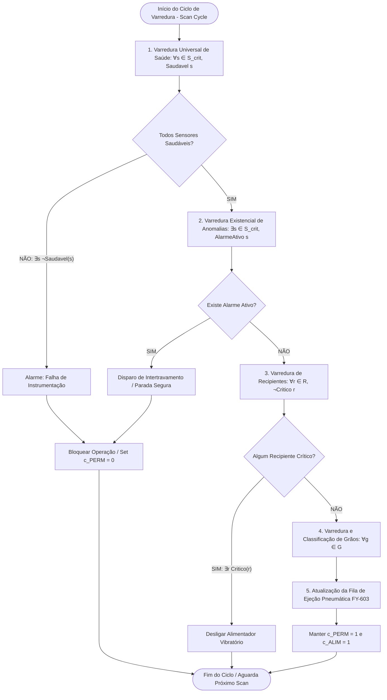

# Aula 06: Quantificadores e Predicados — Varredura Global de Estado

## SCADA-Core Automática — Módulo de Varredura de Estado da Planta Industrial

---

# 1. Introdução e Contextualização

Nas etapas anteriores do projeto **SCADA-Core Automática**, a lógica de intertravamento e classificação foi formulada a partir da **Lógica Proposicional**, na qual variáveis específicas (como `p_PAL601` ou `p_JI201`) são tratadas como proposições atômicas fixas.

Entretanto, em um ambiente industrial moderno com centenas de instrumentos, atuadores e unidades discretas transitando em alta velocidade, a representação proposicional isolada torna-se repetitiva e limitada. A **Lógica de Predicados de Primeira Ordem (LPO)** expande o poder expressivo do sistema ao permitir:

1. A definição de **propriedades e relações** aplicáveis a múltiplos objetos do processo.
2. A formalização de **regras de varredura global** sobre conjuntos de dispositivos através de **quantificadores matemáticos** ($\forall$ e $\exists$).
3. A implementação de um **Módulo de Varredura de Estado (*State Scanning Engine*)** que verifica periodicamente o ciclo de scan do CLP/SCADA, garantindo que a planta opere dentro dos limites seguros e que nenhuma anomalia passe despercebida.

---

# 2. Fundamentos Matemáticos da Lógica de Predicados de Primeira Ordem

## 2.1. Termos, Variáveis e Predicados

* **Termo / Objeto ($x, y, d$):** Representa uma entidade física ou lógica da planta (um sensor, um atuador, um grão de arroz ou uma estação de trabalho).
* **Predicado ($P(x), Q(x, y)$):** Função booleana que mapeia um ou mais termos em um valor-verdade ($\{0, 1\}$ / $\{\text{Falso}, \text{Verdadeiro}\}$), expressando uma propriedade do objeto ou uma relação entre objetos.

Exemplo:
$$\text{Operacional}(s) = \begin{cases} 1, & \text{se o sensor } s \text{ está calibrado e comunicando} \\ 0, & \text{caso contrário} \end{cases}$$

## 2.2. Universo de Discurso (Domínios da Planta)

Para formalizar a planta de seleção de grãos, definem-se os seguintes conjuntos finitos que constituem os universos de discurso:

* **$\mathcal{S}$ (Conjunto de Sensores e Instrumentos):**
  $$\mathcal{S} = \{\text{LIT-101}, \text{ST-201}, \text{WT-301}, \text{XS-401}, \text{KSA-401}, \text{PAL-601}, \text{ZSH-601}, \text{LIT-703}, \text{XA-901}\}$$
* **$\mathcal{S}_{\text{crit}}$ (Subconjunto de Instrumentos de Segurança Crítica):**
  $$\mathcal{S}_{\text{crit}} = \{\text{XA-901}, \text{JI-201}, \text{PAL-601}, \text{KSA-401}, \text{LIT-703}\} \subset \mathcal{S}$$
* **$\mathcal{A}$ (Conjunto de Atuadores e Acionamentos):**
  $$\mathcal{A} = \{\text{AlimentadorVibratorio}, \text{MotorEsteira}, \text{ValvulaFY603}, \text{SinalizadorSonoro}, \text{SinalizadorVisual}\}$$
* **$\mathcal{G}$ (Conjunto de Grãos em Trânsito no Ciclo Atual):**
  $$\mathcal{G} = \{g_1, g_2, \dots, g_n\} \quad (\text{lote de grãos sob inspeção})$$
* **$\mathcal{R}$ (Conjunto de Reservatórios e Silos de Coleta):**
  $$\mathcal{R} = \{\text{FunilRecepcao}, \text{SiloCatA}, \text{SiloCatB}, \text{SiloCatC}\}$$

---

## 2.3. Quantificador Universal ($\forall$)

O quantificador universal indica que uma propriedade é verdadeira para **todos** os elementos pertencentes a um domínio.

$$\forall x \in \mathcal{D}, \; P(x) \iff P(d_1) \land P(d_2) \land \dots \land P(d_m)$$

**Significado em Automação:** Modela condições globais de conformidade, em que **nenhum** elemento pode falhar (equivalente a uma série de blocos AND no CLP).

---

## 2.4. Quantificador Existencial ($\exists$)

O quantificador existencial indica que a propriedade é verdadeira para **pelo menos um** elemento pertencente ao domínio.

$$\exists y \in \mathcal{D}, \; Q(y) \iff Q(d_1) \lor Q(d_2) \lor \dots \lor Q(d_m)$$

**Significado em Automação:** Modela detecção de falhas, alarmes ou eventos pontuais, onde a ocorrência de um único evento exige ação imediata (equivalente a uma série de blocos OR no CLP).

---

## 2.5. Negação e Leis de De Morgan para Quantificadores

As transformações fundamentais da lógica de predicados garantem a equivalência formal entre checagem de conformidade e detecção de anomalias:

1. **Negação do Universal:**
   $$\neg (\forall x \in \mathcal{D}, P(x)) \equiv \exists x \in \mathcal{D}, \neg P(x)$$
   *Leitura:* "Não é verdade que todos os sensores estão saudáveis" equivale a "Existe pelo menos um sensor com falha".

2. **Negação do Existencial:**
   $$\neg (\exists y \in \mathcal{D}, Q(y)) \equiv \forall y \in \mathcal{D}, \neg Q(y)$$
   *Leitura:* "Não existe nenhum alarme ativo na planta" equivale a "Todos os pontos monitorados estão em estado normal".

---

# 3. Modelagem Predicativa dos Componentes da Planta

A tabela a seguir padroniza os predicados utilizados pelo motor de varredura global do SCADA-Core:

| Predicado | Domínio | Significado Físico / Condição de Verdade ($=1$) |
| :--- | :--- | :--- |
| $\text{Saudavel}(s)$ | $s \in \mathcal{S}$ | O sensor $s$ está comunicando na rede industrial sem corte de linha ou falha interna de hardware. |
| $\text{AlarmeAtivo}(s)$ | $s \in \mathcal{S}$ | A variável do sensor $s$ violou os limites de segurança pré-configurados. |
| $\text{EmOperacao}(a)$ | $a \in \mathcal{A}$ | O atuador $a$ está energizado e executando seu movimento. |
| $\text{Sobrecarga}(a)$ | $a \in \mathcal{A}$ | O atuador $a$ está operando com corrente/potência acima da faixa nominal permitida. |
| $\text{ProntoParaPartida}(a)$ | $a \in \mathcal{A}$ | O atuador $a$ possui todas as condições de pré-liberação satisfeitas. |
| $\text{Detectado}(g)$ | $g \in \mathcal{G}$ | O grão $g$ cruzou o sensor de gatilho óptico $\text{XS-401}$. |
| $\text{Conforme}(g)$ | $g \in \mathcal{G}$ | O grão $g$ atende a todos os critérios de Categoria A (cor, tamanho e formato ideais sem defeitos). |
| $\text{Defeituoso}(g)$ | $g \in \mathcal{G}$ | O grão $g$ possui avaria, mancha, praga ou deformação severa (Categoria C). |
| $\text{Secundario}(g)$ | $g \in \mathcal{G}$ | O grão $g$ possui padrão comercial intermediário (Categoria B). |
| $\text{Critico}(r)$ | $r \in \mathcal{R}$ | O reservatório $r$ atingiu ou ultrapassou a capacidade máxima de $100\%$. |

---

# 4. Regras de Varredura Global de Estado

## 4.1. Varredura de Integridade dos Sensores Críticos ($\forall$)

Para que a planta opere com segurança, a rede de sensores críticos deve estar $100\%$ íntegra e comunicável a cada ciclo de scan:

$$\text{RedeSensoresOK} \iff \forall s \in \mathcal{S}_{\text{crit}}, \; \text{Saudavel}(s)$$

Expandindo para os elementos do conjunto $\mathcal{S}_{\text{crit}}$:
$$\text{RedeSensoresOK} \iff \text{Saudavel}(\text{XA-901}) \land \text{Saudavel}(\text{JI-201}) \land \text{Saudavel}(\text{PAL-601}) \land \text{Saudavel}(\text{KSA-401}) \land \text{Saudavel}(\text{LIT-703})$$

---

## 4.2. Varredura Global de Alarmes e Anomalias Ativas ($\exists$)

A detecção de qualquer emergência ou violação de limite em qualquer instrumento gera o estado de alarme consolidado da planta:

$$\text{AnomaliaDetectada} \iff \exists s \in \mathcal{S}, \; \text{AlarmeAtivo}(s)$$

Pela Lei de De Morgan:
$$\neg \text{AnomaliaDetectada} \iff \forall s \in \mathcal{S}, \; \neg \text{AlarmeAtivo}(s)$$

A regra de interrupção de emergência (*Emergency Shutdown*) é modelada como:
$$(\exists s \in \mathcal{S}_{\text{crit}}, \; \text{AlarmeAtivo}(s)) \implies \text{ComandarTripGeral}()$$

---

## 4.3. Varredura de Prontidão Operacional para Partida

A permissão geral para inicialização e manutenção de marcha da planta depende da conjunção de regras universais e existenciais:

$$\text{CondicaoPartidaLiberada} \iff \left( \forall s \in \mathcal{S}_{\text{crit}}, \text{Saudavel}(s) \right) \land \left( \neg \exists s \in \mathcal{S}_{\text{crit}}, \text{AlarmeAtivo}(s) \right) \land \left( \neg \exists r \in \mathcal{R}, \text{Critico}(r) \right)$$

Substituindo a negação do existencial:
$$\text{CondicaoPartidaLiberada} \iff \forall s \in \mathcal{S}_{\text{crit}}, \left( \text{Saudavel}(s) \land \neg \text{AlarmeAtivo}(s) \right) \land \forall r \in \mathcal{R}, \neg \text{Critico}(r)$$

---

## 4.4. Varredura de Qualidade e Rastreabilidade no Fluxo de Grãos

Durante a passagem do lote $\mathcal{G}$ pela esteira sob a câmera $\text{KSA-401}$, o motor de varredura classifica e direciona a ação pneumática para cada elemento $g \in \mathcal{G}$:

1. **Partição Exaustiva e Disjunta do Lote:**
   $$\forall g \in \mathcal{G}, \; \Big( \big( \text{Conforme}(g) \oplus \text{Secundario}(g) \oplus \text{Defeituoso}(g) \big) = 1 \Big)$$
   *Garante matematicamente que cada grão pertence a exatamente uma categoria.*

2. **Gatilho Coletivo de Ejeção Pneumática:**
   $$\forall g \in \mathcal{G}, \; \Big( \big( \text{Defeituoso}(g) \land \text{NaPosicaoEjetor}(g) \land \neg p_{\text{PAL601}} \big) \implies \text{AtivarEjetor}(g) \Big)$$

3. **Alarme de Degradação de Lote na Recepção:**
   Se no lote atual existir uma taxa de rejeitos acima do limiar aceitável $\theta_{\text{rejeito}}$:
   $$\left( \frac{|\{g \in \mathcal{G} \mid \text{Defeituoso}(g)\}|}{|\mathcal{G}|} > \theta_{\text{rejeito}} \right) \implies \text{AlarmeQualidadeLote}()$$

---

# 5. Entregável: Arquitetura e Implementação do Módulo de Varredura

## 5.1. Fluxograma de Varredura Cíclica (Scan Cycle)



---

## 5.2. Especificação Algorítmica em Python (SCADA-Core Engine)

O trecho de código a seguir implementa o módulo formal de varredura global utilizando predicados e quantificadores funcionais (`all()` para $\forall$ e `any()` para $\exists$):

```python
"""
SCADA-Core Automática - Módulo de Varredura Global de Estado
Implementação formal dos operadores de quantificação universal e existencial.
"""

from typing import List, Dict, Any
from dataclasses import dataclass

@dataclass
class Sensor:
    tag: str
    is_critical: bool
    healthy: bool      # Saudavel(s)
    alarm_active: bool # AlarmeAtivo(s)

@dataclass
class Grain:
    id: int
    is_ideal_color: bool
    is_ideal_size: bool
    is_ideal_shape: bool
    has_defect: bool   # Dano, Praga ou Impureza
    position_index: int

class StateScanningEngine:
    def __init__(self, sensors: List[Sensor], tank_levels: Dict[str, float]):
        self.sensors = sensors
        self.tank_levels = tank_levels
        self.critical_sensors = [s for s in self.sensors if s.is_critical]

    # Predicado: ∀s ∈ S_crit, Saudavel(s)
    def check_critical_sensors_health(self) -> bool:
        return all(s.healthy for s in self.critical_sensors)

    # Predicado: ∃s ∈ S_crit, AlarmeAtivo(s)
    def has_critical_alarm(self) -> bool:
        return any(s.alarm_active for s in self.critical_sensors)

    # Predicado: ∃r ∈ R, Nivel(r) >= 100%
    def has_critical_tank_overflow(self) -> bool:
        return any(level >= 100.0 for level in self.tank_levels.values())

    # Varredura Global de Permissivo de Operação
    def evaluate_general_permission(self) -> Dict[str, Any]:
        all_healthy = self.check_critical_sensors_health()
        any_alarm = self.has_critical_alarm()
        overflow = self.has_critical_tank_overflow()

        # c_PERM ↔ (∀s Saudavel(s)) ∧ (¬∃s AlarmeAtivo(s)) ∧ (¬∃r Critico(r))
        c_perm = all_healthy and (not any_alarm) and (not overflow)

        return {
            "c_PERM": c_perm,
            "all_sensors_healthy": all_healthy,
            "has_critical_alarm": any_alarm,
            "overflow_detected": overflow,
            "status_msg": "PLANTA LIBERADA" if c_perm else "INTERTRAVAMENTO ATIVO"
        }

    # Varredura de Lote de Grãos: ∀g ∈ G
    def scan_grain_batch(self, batch: List[Grain]) -> Dict[str, int]:
        cat_a_count = 0
        cat_b_count = 0
        cat_c_count = 0

        for g in batch:
            # Predicado Conforme(g) - Categoria A
            if g.is_ideal_color and g.is_ideal_size and g.is_ideal_shape and not g.has_defect:
                cat_a_count += 1
            # Predicado Defeituoso(g) - Categoria C
            elif g.has_defect or (not g.is_ideal_color and not g.is_ideal_size and not g.is_ideal_shape):
                cat_c_count += 1
            # Predicado Secundario(g) - Categoria B (por exclusão)
            else:
                cat_b_count += 1

        return {
            "total_processed": len(batch),
            "categoria_A": cat_a_count,
            "categoria_B": cat_b_count,
            "categoria_C": cat_c_count
        }

# ==========================================
# Exemplo de Execução do Ciclo de Varredura
# ==========================================
if __name__ == "__main__":
    test_sensors = [
        Sensor(tag="XA-901", is_critical=True, healthy=True, alarm_active=False),
        Sensor(tag="JI-201", is_critical=True, healthy=True, alarm_active=False),
        Sensor(tag="PAL-601", is_critical=True, healthy=True, alarm_active=False),
        Sensor(tag="KSA-401", is_critical=True, healthy=True, alarm_active=False),
        Sensor(tag="LIT-703", is_critical=True, healthy=True, alarm_active=False),
        Sensor(tag="XS-401", is_critical=False, healthy=True, alarm_active=False)
    ]
    tanks = {"FunilRecepcao": 45.0, "SiloCatC": 28.5}

    scanner = StateScanningEngine(sensors=test_sensors, tank_levels=tanks)
    res = scanner.evaluate_general_permission()
    print(f"Resultado da Varredura Global: {res['status_msg']} (c_PERM={res['c_PERM']})")
```

---

# 6. Conclusão

A introdução de **Quantificadores e Lógica de Predicados** no projeto do SCADA-Core confere rigor matemático à rotina cíclica de supervisão da planta de classificação de grãos:

1. A formulação universal ($\forall$) consolida a verificação exaustiva de integridade e prontidão da malha de sensores e subsistemas.
2. A formulação existencial ($\exists$) assegura a captura em tempo real de falhas críticas, disparando de forma determinística os intertravamentos de segurança.
3. As Leis de De Morgan para quantificadores estabelecem a equivalência exata entre a ausência de anomalias e o estado de operação segura.
4. O módulo de varredura em software garante escalabilidade para incorporar novos instrumentos e atuadores sem a necessidade de reescrever a arquitetura lógica fundamental.

