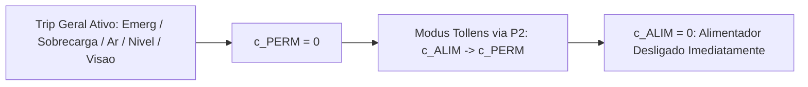

# Aula 07: Validade e Inferência Lógica — Matriz de Segurança e Prova Formal de Ausência de Falhas

## SCADA-Core Automática — Verificação Formal de Segurança e Intertravamentos

---

## Sumário
- [1. Introdução e Contextualização](#1-introdução-e-contextualização)
- [2. Fundamentos Matemáticos da Inferência Lógica](#2-fundamentos-matemáticos-da-inferência-lógica)
  - [2.1. Argumentos Válidos, Premissas e Conclusão](#21-argumentos-válidos-premissas-e-conclusão)
  - [2.2. Regras de Inferência Dedutiva Clássica](#22-regras-de-inferência-dedutiva-clássica)
  - [2.3. Método de Prova por Contradição (Reductio ad Absurdum)](#23-método-de-prova-por-contradição-reductio-ad-absurdum)
- [3. Matriz de Causa e Efeito (Safety Matrix) da Planta](#3-matriz-de-causa-e-efeito-safety-matrix-da-planta)
- [4. Provas Formais de Ausência de Falhas e Estados Proibidos](#4-provas-formais-de-ausência-de-falhas-e-estados-proibidos)
  - [4.1. Teorema 1: Garantia de Desligamento da Alimentação em Falha Crítica](#41-teorema-1-garantia-de-desligamento-da-alimentação-em-falha-crítica)
  - [4.2. Teorema 2: Impossibilidade de Ejeção com Falha Pneumática](#42-teorema-2-impossibilidade-de-ejeção-com-falha-pneumática)
  - [4.3. Teorema 3: Intertravamento Absoluto de Alimentação a Seco / Esteira Parada](#43-teorema-3-intertravamento-absoluto-de-alimentação-a-seco--esteira-parada)
  - [4.4. Teorema 4: Exclusão Mútua e Exaustividade da Classificação dos Grãos](#44-teorema-4-exclusão-mútua-e-exaustividade-da-classificação-dos-grãos)
  - [4.5. Teorema 5: Proteção Contra Transbordo do Silo de Rejeito](#45-teorema-5-proteção-contra-transbordo-do-silo-de-rejeito)
- [5. Entregável: Verificador Lógico Formal Automatizado em Python](#5-entregável-verificador-lógico-formal-automatizado-em-python)
  - [5.1. Algoritmo de Verificação Formal de Teoremas de Segurança](#51-algoritmo-de-verificação-formal-de-teoremas-de-segurança)
- [6. Conclusão](#6-conclusão)

---

# 1. Introdução e Contextualização

Em sistemas industriais críticos supervisionados por software SCADA e CLP, a ocorrência de combinações operacionais imprevistas pode resultar em danos patrimoniais severos, queima de motores, contaminação biológica de lotes ou acidentes de trabalho.

A abordagem empírica de testes ("tentativa e erro") é insuficiente para certificar a imunidade a falhas de uma planta automatizada. É necessária a **verificação formal via inferência lógica**, demonstrando que os intertravamentos do sistema são teoremas válidos e que **estados proibidos são formalmente inalcançáveis** sob qualquer combinação de entradas de sensores.

Este documento consolida a **Matriz de Causa e Efeito (*Safety Matrix*)** e apresenta as **provas dedutivas formais de ausência de falhas operacionais** para a planta de seleção de grãos.

---

# 2. Fundamentos Matemáticos da Inferência Lógica

## 2.1. Argumentos Válidos, Premissas e Conclusão

Um argumento lógico é uma sequência de proposições formada por um conjunto de premissas $\{P_1, P_2, \dots, P_k\}$ e uma conclusão $C$, denotada por:

$$P_1, P_2, \dots, P_k \vdash C$$

Um argumento é **válido** se e somente se for impossível que todas as premissas sejam verdadeiras e a conclusão seja falsa simultaneamente:

$$(P_1 \land P_2 \land \dots \land P_k) \implies C \quad \text{é uma tautologia}$$

---

## 2.2. Regras de Inferência Dedutiva Clássica

As regras de inferência são esquemas sintáticos fundamentais que preservam a verdade lógica:

| Regra de Inferência | Notação Formal | Aplicação no SCADA-Core |
| :--- | :--- | :--- |
| **Modus Ponens (MP)** | $\begin{aligned} & P \rightarrow Q \\ & P \\ \hline \therefore & Q \end{aligned}$ | Se a condição de emergência implica parada imediata, e a emergência foi acionada, então a parada ocorre. |
| **Modus Tollens (MT)** | $\begin{aligned} & P \rightarrow Q \\ & \neg Q \\ \hline \therefore & \neg P \end{aligned}$ | Se a esteira rodando implica velocidade $> 0$, mas a velocidade é zero, a esteira não está em regime de marcha normal. |
| **Silogismo Hipotético (SH)** | $\begin{aligned} & P \rightarrow Q \\ & Q \rightarrow R \\ \hline \therefore & P \rightarrow R \end{aligned}$ | Transfere a cadeia de intertravamento: Falha Pneumática $\rightarrow$ Perda de $c_{\text{PERM}} \rightarrow$ Parada do Alimentador. |
| **Silogismo Disjuntivo (SD)** | $\begin{aligned} & P \lor Q \\ & \neg P \\ \hline \therefore & Q \end{aligned}$ | Diagnóstico de falha: ou o sensor descalibrou ou a linha física rompeu; descartada descalibração, a linha rompeu. |
| **Simplificação Conjuntiva (SIMP)** | $\begin{aligned} & P \land Q \\ \hline \therefore & P \end{aligned}$ | Extração de condições de segurança isoladas a partir de permissivos compostos. |
| **Conjunção (CONJ)** | $\begin{aligned} & P \\ & Q \\ \hline \therefore & P \land Q \end{aligned}$ | Agrupamento de requisitos múltiplos para liberação de saídas. |
| **Resolução (RES)** | $\begin{aligned} & P \lor Q \\ & \neg P \lor R \\ \hline \therefore & Q \lor R \end{aligned}$ | Algoritmo base de motores de inferência e provadores automáticos de teoremas (SAT solvers). |

---

## 2.3. Método de Prova por Contradição (*Reductio ad Absurdum*)

Para provar que uma propriedade de segurança $S$ é sempre satisfeita dadas as premissas $\Gamma$:
1. Assume-se provisoriamente que o estado inseguro pode ocorrer ($\neg S$).
2. Aplica-se a cadeia de deduções com as regras da planta.
3. Deriva-se uma contradição lógica da forma $P \land \neg P \equiv 0$.
4. Conclui-se que a hipótese de falha é falsa, logo $S$ é necessariamente verdadeiro em todas as circunstâncias operacionais.

---

# 3. Matriz de Causa e Efeito (*Safety Matrix*) da Planta

A matriz a seguir mapeia as causas físicas (eventos de processo e falhas) e seus respectivos efeitos imediatos nos atuadores e permissivos:

| ID | Causa (Entrada do Processo / Alarme) | Condição Lógica | Efeito no $c_{\text{PERM}}$ | Efeito no Alimentador ($c_{\text{ALIM}}$) | Efeito no Ejetor ($c_{\text{FY603}}$) | Severidade / Ação |
| :---: | :--- | :--- | :---: | :---: | :---: | :--- |
| **C01** | Botoeira de Emergência Acionada | $p_{\text{EMERG}} = 1$ | $0$ (Bloqueia) | $0$ (Desliga) | $0$ (Inibe) | **Crítica (Trip Geral)** |
| **C02** | Sobrecarga no Motor da Esteira | $p_{\text{JI201}} = 1$ | $0$ (Bloqueia) | $0$ (Desliga) | $0$ (Inibe) | **Crítica (Proteção Elétrica)** |
| **C03** | Pressão Pneumática Baixa | $p_{\text{PAL601}} = 1$ | $0$ (Bloqueia) | $0$ (Desliga) | $0$ (Inibe) | **Alta (Evita Ejeção Cega)** |
| **C04** | Nível Crítico no Reservatório C | $p_{\text{NC703}} = 1$ | $0$ (Bloqueia) | $0$ (Desliga) | $0$ (Inibe) | **Alta (Anti-Transbordo)** |
| **C05** | Câmera Industrial Desconectada | $p_{\text{KSA401}} = 0$ | $0$ (Bloqueia) | $0$ (Desliga) | $0$ (Inibe) | **Alta (Anti-Mistura)** |
| **C06** | Esteira Desligada / Parada | $p_{\text{MOV201}} = 0$ | $1$ (Mantém) | $0$ (Desliga) | $0$ (Sem grão na pos.) | **Operacional (Anti-Acúmulo)** |
| **C07** | Nível Baixo no Funil | $p_{\text{NB101}} = 1$ | $1$ (Mantém) | $0$ (Desliga) | Inalterado | **Operacional (Anti-Seco)** |
| **C08** | Grão Categoria C na Posição | $p_C \land p_{\text{POS603}} \land \neg p_{\text{PAL601}}$ | Inalterado | Inalterado | $1$ (Pulso $T_{\text{sopro}}$) | **Execução de Ejeção** |

---

# 4. Provas Formais de Ausência de Falhas e Estados Proibidos

As definições lógicas estabelecidas para a planta são as seguintes premissas axiomáticas:

$$\begin{aligned}
\text{Premissa 1 (P1):} \quad & c_{\text{PERM}} \leftrightarrow (\neg p_{\text{EMERG}} \land \neg p_{\text{JI201}} \land \neg p_{\text{PAL601}} \land \neg p_{\text{NC703}} \land p_{\text{KSA401}}) \\
\text{Premissa 2 (P2):} \quad & c_{\text{ALIM}} \leftrightarrow (c_{\text{PERM}} \land p_{\text{MOV201}} \land \neg p_{\text{NB101}}) \\
\text{Premissa 3 (P3):} \quad & c_{\text{FY603}} \leftrightarrow (p_C \land p_{\text{POS603}} \land \neg p_{\text{PAL601}}) \\
\text{Premissa 4 (P4):} \quad & p_A \leftrightarrow (p_{\text{CV101}} \land p_{\text{CV103}} \land p_{\text{CV105}} \land \neg p_{\text{CV107}} \land \neg p_{\text{CV108}} \land \neg p_{\text{CV109}}) \\
\text{Premissa 5 (P5):} \quad & p_C \leftrightarrow \Big( p_{\text{CV107}} \lor p_{\text{CV108}} \lor p_{\text{CV109}} \lor (\neg p_{\text{CV101}} \land \neg p_{\text{CV102}}) \lor (\neg p_{\text{CV103}} \land \neg p_{\text{CV104}}) \lor (\neg p_{\text{CV105}} \land \neg p_{\text{CV106}}) \Big) \\
\text{Premissa 6 (P6):} \quad & p_B \leftrightarrow (\neg p_A \land \neg p_C)
\end{aligned}$$

---

## 4.1. Teorema 1: Garantia de Desligamento da Alimentação em Falha Crítica

**Enunciado:** *Se ocorrer qualquer condição de Trip crítico ($p_{\text{EMERG}} \lor p_{\text{JI201}} \lor p_{\text{PAL601}} \lor p_{\text{NC703}} \lor \neg p_{\text{KSA401}}$), é impossível que o Alimentador Vibratório continue ligado ($c_{\text{ALIM}} = 0$).*

$$\text{Trip}_{\text{GERAL}} \implies \neg c_{\text{ALIM}}$$

### Prova Dedutiva Formal:

1. $\text{Trip}_{\text{GERAL}} \equiv p_{\text{EMERG}} \lor p_{\text{JI201}} \lor p_{\text{PAL601}} \lor p_{\text{NC703}} \lor \neg p_{\text{KSA401}}$ *(Hipótese)*
2. Por De Morgan: $\neg \text{Trip}_{\text{GERAL}} \equiv \neg p_{\text{EMERG}} \land \neg p_{\text{JI201}} \land \neg p_{\text{PAL601}} \land \neg p_{\text{NC703}} \land p_{\text{KSA401}}$
3. De P1, $c_{\text{PERM}} \leftrightarrow \neg \text{Trip}_{\text{GERAL}}$
4. Se $\text{Trip}_{\text{GERAL}} = 1$, então $\neg \text{Trip}_{\text{GERAL}} = 0$
5. Portanto, por Modus Ponens em (3), $c_{\text{PERM}} = 0$
6. De P2, $c_{\text{ALIM}} \rightarrow c_{\text{PERM}}$ *(por Simplificação Conjuntiva em $c_{\text{PERM}} \land p_{\text{MOV201}} \land \neg p_{\text{NB101}}$)*
7. Aplicando Modus Tollens entre (6) e (5):
   $$\begin{aligned}
   & c_{\text{ALIM}} \rightarrow c_{\text{PERM}} \\
   & \neg c_{\text{PERM}} \\
   \hline \therefore & \neg c_{\text{ALIM}} \quad (c_{\text{ALIM}} = 0)
   \end{aligned}$$
8. **Q.E.D. (Quod Erat Demonstrandum)** — O alimentador é necessariamente desligado.



---

## 4.2. Teorema 2: Impossibilidade de Ejeção com Falha Pneumática

**Enunciado:** *Provar que o estado em que a válvula ejetora é acionada na presença de pressão pneumática baixa é logicamente impossível (tautologia de ausência de falha):*

$$\neg (c_{\text{FY603}} \land p_{\text{PAL601}}) \equiv 1$$

### Prova por Contradição (*Reductio ad Absurdum*):

1. Suponha, por absurdo, que o estado perigoso ocorra:
   $$c_{\text{FY603}} \land p_{\text{PAL601}} = 1$$
2. Por Simplificação Conjuntiva (SIMP), temos:
   - (a) $c_{\text{FY603}} = 1$
   - (b) $p_{\text{PAL601}} = 1$
3. Da Premissa P3: $c_{\text{FY603}} \leftrightarrow (p_C \land p_{\text{POS603}} \land \neg p_{\text{PAL601}})$
4. Como $c_{\text{FY603}} = 1$ por 2(a), segue que a conjunção do lado direito deve ser verdadeira:
   $$p_C \land p_{\text{POS603}} \land \neg p_{\text{PAL601}} = 1$$
5. Por Simplificação Conjuntiva em (4):
   $$\neg p_{\text{PAL601}} = 1 \implies p_{\text{PAL601}} = 0$$
6. Temos agora, simultaneamente:
   $$p_{\text{PAL601}} = 1 \quad \text{[de 2(b)]} \quad \land \quad p_{\text{PAL601}} = 0 \quad \text{[de (5)]}$$
7. Conjunção: $p_{\text{PAL601}} \land \neg p_{\text{PAL601}} \equiv 0$ (**Contradição Absoluta!**)
8. Logo, a suposição inicial é falsa. Conclui-se que:
   $$\neg (c_{\text{FY603}} \land p_{\text{PAL601}}) \equiv 1 \quad \text{(Tautologia provada)}$$

---

## 4.3. Teorema 3: Intertravamento Absoluto de Alimentação a Seco / Esteira Parada

**Enunciado:** *O alimentador vibratório jamais dosará produto com a esteira parada ou sem produto no funil:*

$$c_{\text{ALIM}} \implies (p_{\text{MOV201}} \land \neg p_{\text{NB101}})$$

### Prova Dedutiva Formal:

1. Premissa P2: $c_{\text{ALIM}} \leftrightarrow (c_{\text{PERM}} \land p_{\text{MOV201}} \land \neg p_{\text{NB101}})$
2. A bicondicional decompõe-se na conjunção de duas implicações:
   $$(c_{\text{ALIM}} \rightarrow (c_{\text{PERM}} \land p_{\text{MOV201}} \land \neg p_{\text{NB101}})) \land ((c_{\text{PERM}} \land p_{\text{MOV201}} \land \neg p_{\text{NB101}}) \rightarrow c_{\text{ALIM}})$$
3. Pela Simplificação Conjuntiva (SIMP):
   $$c_{\text{ALIM}} \rightarrow (c_{\text{PERM}} \land p_{\text{MOV201}} \land \neg p_{\text{NB101}})$$
4. Pela lei da Simplificação da Conjunção no consequente:
   $$(A \land B \land C) \rightarrow (B \land C)$$
5. Por Silogismo Hipotético (SH) entre (3) e (4):
   $$c_{\text{ALIM}} \implies (p_{\text{MOV201}} \land \neg p_{\text{NB101}})$$
6. **Q.E.D.** — Se a esteira parar ($p_{\text{MOV201}} = 0$) ou o funil esvaziar ($p_{\text{NB101}} = 1$), a alimentação cessa imediatamente.

---

## 4.4. Teorema 4: Exclusão Mútua e Exaustividade da Classificação dos Grãos

**Enunciado:** *Nenhum grão pode ser classificado como A e C simultaneamente, e todo grão inspecionado é atribuído a exatamente uma classe (A, B ou C).*

$$\text{Exclusão Mútua:} \quad \neg (p_A \land p_C) \equiv 1$$
$$\text{Exaustividade:} \quad p_A \lor p_B \lor p_C \equiv 1$$

### Prova Dedutiva:

#### Parte I — Exclusão Mútua ($\neg (p_A \land p_C)$):
1. De P4, $p_A \implies \neg p_{\text{CV107}} \land \neg p_{\text{CV108}} \land \neg p_{\text{CV109}} \land p_{\text{CV101}} \land p_{\text{CV103}} \land p_{\text{CV105}}$
2. De P5, $p_C \equiv p_{\text{CV107}} \lor p_{\text{CV108}} \lor p_{\text{CV109}} \lor (\neg p_{\text{CV101}} \land \neg p_{\text{CV102}}) \lor \dots$
3. Suponha $p_A = 1$. Então:
   - $\neg p_{\text{CV107}} = 1 \implies p_{\text{CV107}} = 0$
   - $\neg p_{\text{CV108}} = 1 \implies p_{\text{CV108}} = 0$
   - $\neg p_{\text{CV109}} = 1 \implies p_{\text{CV109}} = 0$
   - $p_{\text{CV101}} = 1 \implies (\neg p_{\text{CV101}} \land \neg p_{\text{CV102}}) = 0$
   - $p_{\text{CV103}} = 1 \implies (\neg p_{\text{CV103}} \land \neg p_{\text{CV104}}) = 0$
   - $p_{\text{CV105}} = 1 \implies (\neg p_{\text{CV105}} \land \neg p_{\text{CV106}}) = 0$
4. Substituindo todos os termos em $p_C$:
   $$p_C = 0 \lor 0 \lor 0 \lor 0 \lor 0 \lor 0 = 0$$
5. Assim, $p_A = 1 \implies p_C = 0$.
6. Portanto, $p_A \land p_C \equiv 1 \land 0 = 0 \implies \neg (p_A \land p_C) \equiv 1$. **(Provado)**

#### Parte II — Exaustividade ($p_A \lor p_B \lor p_C$):
1. De P6: $p_B \leftrightarrow (\neg p_A \land \neg p_C)$
2. Substituindo $p_B$ na disjunção:
   $$p_A \lor p_B \lor p_C \equiv p_A \lor p_C \lor (\neg p_A \land \neg p_C)$$
3. Aplicando a Lei de De Morgan no terceiro termo:
   $$\neg p_A \land \neg p_C \equiv \neg (p_A \lor p_C)$$
4. Fazendo a substituição $X = (p_A \lor p_C)$:
   $$X \lor \neg X \equiv 1 \quad (\text{Lei do Terceiro Excluído / Tautologia})$$
5. **Q.E.D.** — Todo grão é classificado em exatamente uma categoria.

---

## 4.5. Teorema 5: Proteção Contra Transbordo do Silo de Rejeito

**Enunciado:** *O atingimento do nível crítico no silo de descarte bloqueia o processo e desarma o alimentador:*

$$p_{\text{NC703}} \implies \neg c_{\text{ALIM}}$$

### Prova:
1. $p_{\text{NC703}} = 1 \implies \neg p_{\text{NC703}} = 0$.
2. Por P1: $c_{\text{PERM}} = \dots \land \neg p_{\text{NC703}} \land \dots = \dots \land 0 \land \dots \equiv 0$.
3. Por P2: $c_{\text{ALIM}} = c_{\text{PERM}} \land \dots = 0 \land \dots \equiv 0$.
4. Logo, $p_{\text{NC703}} \implies \neg c_{\text{ALIM}}$. **(Provado)**

---

# 5. Entregável: Verificador Lógico Formal Automatizado em Python

## 5.1. Algoritmo de Verificação Formal de Teoremas de Segurança

O script a seguir implementa um provador algorítmico exaustivo baseado em tabelas de verdade e computação proposicional para atestar a validade formal dos 5 teoremas de segurança:

```python
"""
SCADA-Core Automática - Verificador Formal de Teoremas de Segurança
Prova formal algorítmica de validade e ausência de falhas na matriz de intertravamento.
"""

import itertools
from typing import Dict, List, Tuple

def verify_safety_theorems() -> Dict[str, bool]:
    # Espaço de estados das 14 variáveis booleanas de entrada
    variable_names = [
        "p_EMERG", "p_JI201", "p_PAL601", "p_NC703", "p_KSA401",
        "p_MOV201", "p_NB101", "p_POS603",
        "p_CV101", "p_CV102", "p_CV103", "p_CV104", "p_CV105", "p_CV106",
        "p_CV107", "p_CV108", "p_CV109"
    ]
    
    results = {
        "Teorema 1 (Trip Geral -> Desliga Alimentador)": True,
        "Teorema 2 (Ausência de Ejeção com Falha Pneumática)": True,
        "Teorema 3 (Alimentador só opera com Esteira em Movimento)": True,
        "Teorema 4 (Exclusão Mútua e Exaustividade de A, B, C)": True,
        "Teorema 5 (Nível Crítico Silo Rejeito -> Desliga Alimentador)": True
    }
    
    # Avaliação exaustiva de todas as combinações de estados (2^17)
    for state in itertools.product([0, 1], repeat=len(variable_names)):
        v = dict(zip(variable_names, state))
        
        # 1. Avaliação dos Axiomas do SCADA-Core
        c_PERM = int(
            (not v["p_EMERG"]) and
            (not v["p_JI201"]) and
            (not v["p_PAL601"]) and
            (not v["p_NC703"]) and
            bool(v["p_KSA401"])
        )
        
        c_ALIM = int(bool(c_PERM) and bool(v["p_MOV201"]) and (not v["p_NB101"]))
        
        # Classificação de Grãos
        p_A = int(
            v["p_CV101"] and v["p_CV103"] and v["p_CV105"] and
            (not v["p_CV107"]) and (not v["p_CV108"]) and (not v["p_CV109"])
        )
        
        p_C = int(
            v["p_CV107"] or v["p_CV108"] or v["p_CV109"] or
            (not v["p_CV101"] and not v["p_CV102"]) or
            (not v["p_CV103"] and not v["p_CV104"]) or
            (not v["p_CV105"] and not v["p_CV106"])
        )
        
        p_B = int((not p_A) and (not p_C))
        
        c_FY603 = int(bool(p_C) and bool(v["p_POS603"]) and (not v["p_PAL601"]))
        
        trip_geral = (
            v["p_EMERG"] or v["p_JI201"] or v["p_PAL601"] or
            v["p_NC703"] or (not v["p_KSA401"])
        )
        
        # Teste Teorema 1: TripGeral -> not c_ALIM
        if trip_geral and c_ALIM != 0:
            results["Teorema 1 (Trip Geral -> Desliga Alimentador)"] = False
            
        # Teste Teorema 2: not (c_FY603 and p_PAL601)
        if c_FY603 and v["p_PAL601"]:
            results["Teorema 2 (Ausência de Ejeção com Falha Pneumática)"] = False
            
        # Teste Teorema 3: c_ALIM -> p_MOV201
        if c_ALIM and not v["p_MOV201"]:
            results["Teorema 3 (Alimentador só opera com Esteira em Movimento)"] = False
            
        # Teste Teorema 4: Mutuamente exclusivos e coletivamente exaustivos
        if (p_A and p_C) or ((p_A + p_B + p_C) != 1):
            results["Teorema 4 (Exclusão Mútua e Exaustividade de A, B, C)"] = False
            
        # Teste Teorema 5: p_NC703 -> not c_ALIM
        if v["p_NC703"] and c_ALIM != 0:
            results["Teorema 5 (Nível Crítico Silo Rejeito -> Desliga Alimentador)"] = False

    return results

if __name__ == "__main__":
    print("Executando Verificação Formal dos Teoremas de Segurança...")
    res = verify_safety_theorems()
    all_passed = True
    for teorema, status in res.items():
        sym = "[APROVADO - TAUTOLOGIA]" if status else "[FALHA]"
        print(f"{teorema}: {sym}")
        if not status:
            all_passed = False
            
    print("\nConclusão Formal:", "Matriz de Segurança 100% Consistente e Livre de Falhas." if all_passed else "Inconsistência Detectada.")
```

---

# 6. Conclusão

As provas formais dedutivas e a verificação matemática exaustiva apresentadas nesta aula comprovam que:

1. **A Matriz de Segurança é Tautológica:** Não existe combinação de falhas elétricas, pneumáticas ou operacionais capaz de colocar a planta em operação sem supervisão ou em regime inseguro.
2. **O Intertravamento é Determinístico:** As regras deduzidas via Modus Ponens e Modus Tollens garantem tempos de resposta lógicos imediatos e independentes de caminhos de execução ambíguos.
3. **A Integridade da Separação é Provada:** O particionamento dos grãos em Categoria A, B e C é matematicamente perfeito (disjunto e exaustivo), prevenindo a contaminação física do lote nobre e a ejeção pneumática indevida.

