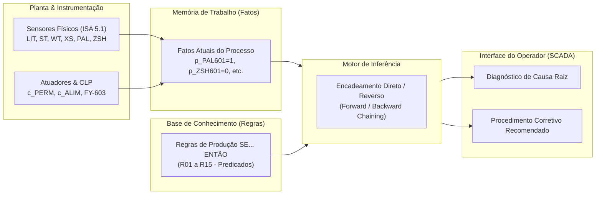

# Aula 08: Lógica de Predicados e Regras — Base de Regras do Sistema Especialista

## SCADA-Core Automática — Diagnóstico de Causa Raiz e Suporte à Operação

---

# 1. Introdução e Arquitetura de Sistemas Especialistas

## 1.1. Do Intertravamento Reativo ao Diagnóstico Inteligente

Enquanto a lógica de intertravamento (abordada nas Aulas 02 a 07) atua de maneira **reativa e imediata** para paralisar atuadores sob condições de perigo, ela não explica ao operador **por que** uma falha ocorreu ou qual evento foi o detonador primário da anomalia.

Em uma planta integrada de alta velocidade, a ocorrência de um evento inicial frequentemente gera uma cascata de alarmes secundários (*alarm avalanche*). Um **Sistema Especialista Baseado em Regras (*Rule-Based Expert System*)** utiliza a **Lógica de Predicados** para cruzar múltiplos sintomas simultâneos, deduzir a **causa raiz (*root cause*)** do problema e instruir a equipe de manutenção com ações corretivas claras na IHM do SCADA.

---

## 1.2. Estrutura do Sistema Especialista Industrial

1. **Base de Fatos (Memória de Trabalho):** Armazena os estados lógicos instantâneos das variáveis do processo ($p_{\text{TAG}}$ e $c_{\text{TAG}}$).
2. **Base de Conhecimento:** Conjunto de regras de produção codificando a inteligência operacional e a experiência dos engenheiros de automação.
3. **Motor de Inferência:** Módulo responsável por avaliar premissas e derivar novos fatos e conclusões.
4. **Interface SCADA:** Exibe para a equipe de operação o diagnóstico contextualizado e o plano de ação mitigatória.

---

# 2. Representação Formal do Conhecimento via Regras de Produção

## 2.1. Sintaxe das Regras SE... ENTÃO (IF-THEN)

Cada regra de produção $R_k$ na base de conhecimento é formalizada na lógica de predicados como:

$$\mathcal{R}_k: \mathbf{SE} \;\; \Phi(\vec{x}) \;\; \mathbf{ENT\tilde{A}O} \;\; \Psi(\vec{y}) \;\; \mathbf{COM\_A\c{C}\tilde{A}O} \;\; \Omega(\vec{z})$$

Onde:
* $\Phi(\vec{x})$: **Antecedente / Premissa** (conjunção ou disjunção de predicados sobre variáveis de processo).
* $\Psi(\vec{y})$: **Consequente / Diagnóstico** (identificação determinística da causa raiz).
* $\Omega(\vec{z})$: **Prescrição Operacional** (procedimento de intervenção técnica).

---

## 2.2. Níveis de Severidade e Fatores de Certeza

As regras são classificadas conforme o impacto operacional:

* **Crítica (Nível 1):** Risco iminente à integridade de pessoas ou máquinas; acarreta trip imediato e bloqueio físico.
* **Alta (Nível 2):** Falha grave de qualidade ou paralisação de subsistema sem dano catastrófico.
* **Média (Nível 3):** Degradação de performance, desvio de setpoint ou alerta preventivo de manutenção.
* **Baixa / Informativa (Nível 4):** Notificação de eventos de rotina ou transição de batelada.

---

# 3. Entregável: Base de Regras de Conhecimento da Planta

A seguir, apresentam-se as regras de diagnóstico organizadas por subsistema do processo de seleção de grãos.

---

## 3.1. Módulo A — Recepção, Nível e Alimentador Vibratório

### Regra R01: Falha por Obstrução / Entupimento na Boca do Funil
* **Condição:** Alimentador acionado ($c_{\text{ALIM}} = 1$), esteira rodando ($p_{\text{MOV201}} = 1$), nível do funil com grãos ($\neg p_{\text{NB101}} = 1$), porém vazão mássica nula ($FT301 = 0$) após tempo $T_1$.
* **Formulação Predicativa:**
  $$R_{01}: (c_{\text{ALIM}} \land p_{\text{MOV201}} \land \neg p_{\text{NB101}} \land \text{VazaoNula}(FT301)) \implies \text{CausaRaiz}(\text{"Obstrução Mecânica no Bocal do Funil"})$$
* **Ação Recomendada:** Interromper alimentador e inspecionar grade de proteção contra grumos ou corpos estranhos.

### Regra R02: Alerta Preventivo de Desabastecimento da Linha
* **Condição:** Nível baixo no funil ($p_{\text{NB101}} = 1$) com alimentador em operação.
* **Formulação Predicativa:**
  $$R_{02}: (p_{\text{NB101}} \land c_{\text{ALIM}}) \implies \text{Diagnostico}(\text{"Funil Próximo ao Esvaziamento"})$$
* **Ação Recomendada:** Solicitar reabastecimento imediato de grãos brutos pelo silo de descarga.

---

## 3.2. Módulo B — Tração da Esteira e Transporte Contínuo

### Regra R03: Travamento Mecânico da Correia Transportadora
* **Condição:** Comando do motor da esteira ativo ($c_{\text{ESTEIRA}} = 1$), relé de sobrecarga atuado ($p_{\text{JI201}} = 1$) e velocidade medida nula ($p_{\text{MOV201}} = 0$).
* **Formulação Predicativa:**
  $$R_{03}: (c_{\text{ESTEIRA}} \land p_{\text{JI201}} \land \neg p_{\text{MOV201}}) \implies \text{CausaRaiz}(\text{"Travamento Mecânico no Rolo ou Correia da Esteira"})$$
* **Ação Recomendada:** Realizar bloqueio LOTO (Lockout/Tagout), inspecionar mancais e remover grãos prensados.

### Regra R04: Falha no Encoder de Velocidade ou Patinagem Severa
* **Condição:** Comando do motor da esteira ativo ($c_{\text{ESTEIRA}} = 1$), sem sobrecarga no motor ($\neg p_{\text{JI201}} = 1$), porém velocidade nula ou instável ($p_{\text{MOV201}} = 0$).
* **Formulação Predicativa:**
  $$R_{04}: (c_{\text{ESTEIRA}} \land \neg p_{\text{JI201}} \land \neg p_{\text{MOV201}}) \implies \text{CausaRaiz}(\text{"Falha de Leitura no Sensor ST-201 ou Correia Patinando"})$$
* **Ação Recomendada:** Inspecionar acoplamento mecânico do encoder incremental e tensão da correia.

---

## 3.3. Módulo C — Pesagem Dinâmica e Vazão Mássica

### Regra R05: Sobrecarga Dinâmica na Seção de Pesagem
* **Condição:** Massa instantânea lida por $\text{WT-301}$ superior a $150\%$ da capacidade nominal da calha de pesagem.
* **Formulação Predicativa:**
  $$R_{05}: (\text{SobrecargaMassa}(WT301)) \implies \text{CausaRaiz}(\text{"Excessiva Camada de Grãos ou Impacto Físico na Célula WT-301"})$$
* **Ação Recomendada:** Reduzir amplitude do alimentador vibratório e aferir tara da balança.

### Regra R06: Desvio de Calibração / Deriva de Zero da Balança
* **Condição:** Esteira em movimento sem alimentação ($c_{\text{ALIM}} = 0$) e $\text{WT-301} > \text{ZeroOffset}$.
* **Formulação Predicativa:**
  $$R_{06}: (\neg c_{\text{ALIM}} \land p_{\text{MOV201}} \land \text{MassaResidual}(WT301)) \implies \text{Diagnostico}(\text{"Deriva de Zero / Acúmulo de Pó na Célula de Carga"})$$
* **Ação Recomendada:** Efetuar rotina de auto-zero na IHM do SCADA e limpeza superficial da calha.

---

## 3.4. Módulo D — Visão Computacional e Gatilho Óptico

### Regra R07: Falha de Comunicação ou Software da Câmera Industrial
* **Condição:** Sinal de status da câmera em nível lógico baixo ($p_{\text{KSA401}} = 0$).
* **Formulação Predicativa:**
  $$R_{07}: (\neg p_{\text{KSA401}}) \implies \text{CausaRaiz}(\text{"Falha de Comunicação GigE/USB ou Travamento do Algoritmo de Visão"})$$
* **Ação Recomendada:** Reinicializar serviço de processamento de imagem e checar cabeamento de rede.

### Regra R08: Degradação Severa do Lote de Grãos Recebido
* **Condição:** Taxa de grãos classificados como Categoria C superior a $35\%$ nos últimos $1000$ grãos inspecionados.
* **Formulação Predicativa:**
  $$R_{08}: (\text{TaxaRejeicaoAlta}(\text{SCADA})) \implies \text{Diagnostico}(\text{"Matéria-Prima com Alto Índice de Contaminação/Pragas"})$$
* **Ação Recomendada:** Emitir alerta ao controle de qualidade e segregar fornecedor do lote em processamento.

### Regra R09: Sujeira ou Obstrução na Lente da Câmera / Iluminação
* **Condição:** Câmera operacional ($p_{\text{KSA401}} = 1$), sensor de gatilho detectando passagem ($p_{\text{XS401}} = 1$), porém todas as classificações resultando em Categoria C consecutivamente ($N_{\text{rejeito}} > 50$).
* **Formulação Predicativa:**
  $$R_{09}: (p_{\text{KSA401}} \land p_{\text{XS401}} \land \text{RejeicaoAnomalaConsecutiva}()) \implies \text{CausaRaiz}(\text{"Lente Obstruída por Poeira ou Falha na Iluminação LED"})$$
* **Ação Recomendada:** Inspecionar e limpar o vidro protetor do domo óptico e verificar luminária de alta frequência.

---

## 3.5. Módulo E — Sistema Pneumático e Atuadores de Ejeção

### Regra R10: Falha Crítica na Linha de Ar Comprimido (Pressão Baixa)
* **Condição:** Pressostato digital atuado ($p_{\text{PAL601}} = 1$).
* **Formulação Predicativa:**
  $$R_{10}: (p_{\text{PAL601}}) \implies \text{CausaRaiz}(\text{"Queda de Pressão no Suprimento Pneumático Principal"})$$
* **Ação Recomendada:** Verificar compressor, dreno de condensado e vazamento em conexões de mangueira PU.

### Regra R11: Falha Eletromecânica no Atuador / Válvula Ejetora FY-603
* **Condição:** Comando de disparo enviado ($c_{\text{FY603}} = 1$), pressão normal ($\neg p_{\text{PAL601}} = 1$), mas sem confirmação do sensor magnético ($p_{\text{ZSH601}} = 0$) após tempo $T_{\text{espera}}$.
* **Formulação Predicativa:**
  $$R_{11}: (c_{\text{FY603}} \land \neg p_{\text{PAL601}} \land \neg p_{\text{ZSH601}}) \implies \text{CausaRaiz}(\text{"Queima da Bobina da Solenoide FY-603 ou Travamento do Carretel"})$$
* **Ação Recomendada:** Testar tensão de acionamento 24VDC e substituir válvula de resposta rápida.

---

## 3.6. Módulo F — Coleta, Silos de Rejeito e Transbordo

### Regra R12: Silo de Rejeitos em Capacidade Crítica (Risco de Transbordo)
* **Condição:** Sensor de nível do silo de descarte acima de $100\%$ ($p_{\text{NC703}} = 1$).
* **Formulação Predicativa:**
  $$R_{12}: (p_{\text{NC703}}) \implies \text{CausaRaiz}(\text{"Silo de Categoria C Cheio sem Esvaziamento"})$$
* **Ação Recomendada:** Realizar troca da bombona/caçamba de rejeitos e resetar o alarme na IHM.

---

# 4. Catálogo Consolidado de Regras do Sistema Especialista

| ID | Subsistema | Premissa Lógica (Fatos) | Causa Raiz Diagnosticada | Severidade | Ação Mitigadora na IHM |
| :---: | :--- | :--- | :--- | :---: | :--- |
| **R01** | Alimentação | $c_{\text{ALIM}} \land p_{\text{MOV201}} \land \neg p_{\text{NB101}} \land FT301 = 0$ | Obstrução mecânica no bocal do funil | Média | Desobstruir grade de alimentação |
| **R02** | Alimentação | $p_{\text{NB101}} \land c_{\text{ALIM}}$ | Funil no nível mínimo operacional | Baixa | Reabastecer funil de entrada |
| **R03** | Tração | $c_{\text{ESTEIRA}} \land p_{\text{JI201}} \land \neg p_{\text{MOV201}}$ | Travamento mecânico no rolo/motor | Crítica | Desligar disjuntor, LOTO e checar mancais |
| **R04** | Tração | $c_{\text{ESTEIRA}} \land \neg p_{\text{JI201}} \land \neg p_{\text{MOV201}}$ | Falha no encoder ST-201 ou patinagem | Alta | Inspecionar acoplamento do encoder |
| **R05** | Pesagem | $WT301 > 1.5 \times \text{CapacNominal}$ | Sobrecarga de produto na esteira | Média | Ajustar dosagem do alimentador |
| **R06** | Pesagem | $\neg c_{\text{ALIM}} \land p_{\text{MOV201}} \land WT301 > \text{Tol}$ | Deriva de zero na célula de carga | Baixa | Executar calibração de zero (tara) |
| **R07** | Visão | $\neg p_{\text{KSA401}}$ | Falha no hardware/driver da câmera | Alta | Reiniciar serviço de visão / checar rede |
| **R08** | Qualidade | $\text{TaxaRejeicao} > 35\%$ | Lote de grãos altamente contaminado | Média | Notificar controle de qualidade de grãos |
| **R09** | Visão | $p_{\text{KSA401}} \land p_{\text{XS401}} \land N_{\text{rejeito}} > 50$ | Lente suja ou falha na iluminação | Alta | Limpar lente óptica / checar iluminação |
| **R10** | Pneumática | $p_{\text{PAL601}}$ | Falha no suprimento de ar comprimido | Alta | Verificar rede de ar e compressor |
| **R11** | Ejeção | $c_{\text{FY603}} \land \neg p_{\text{PAL601}} \land \neg p_{\text{ZSH601}}$ | Falha elétrica/mecânica na válvula FY-603 | Crítica | Trocar solenoide / válvula de ejeção |
| **R12** | Coleta | $p_{\text{NC703}}$ | Silo de rejeito saturado (100%) | Alta | Substituir reservatório de Categoria C |

---

# 6. Conclusão

A **Base de Regras do Sistema Especialista** desenvolvida para o **SCADA-Core Automática**:

1. **Transforma Dados Brutos em Inteligência:** Converte leituras booleanas e analógicas desconexas em diagnósticos contextuais precisos sobre a saúde operacional da planta.
2. **Reduz o Tempo Médio de Reparo (MTTR):** Guia o operador e a manutenção diretamente à causa raiz do defeito, eliminando diagnósticos incorretos durante paradas de linha.
3. **Prepara a Integração com o Motor de Inferência (Aula 09):** A estrutura formal de predicados e regras de produção em formato estruturado permite a aplicação direta de algoritmos de encadeamento direto (*Forward Chaining*) e reverso (*Backward Chaining*).
