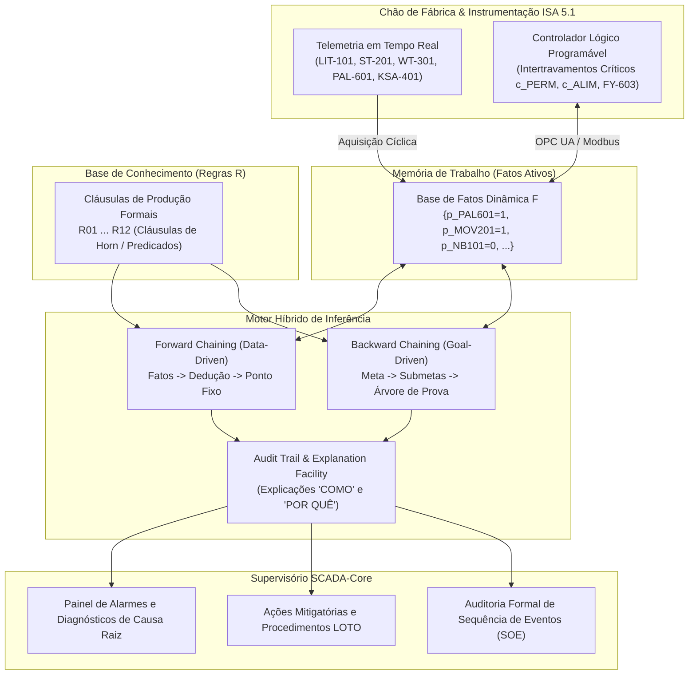
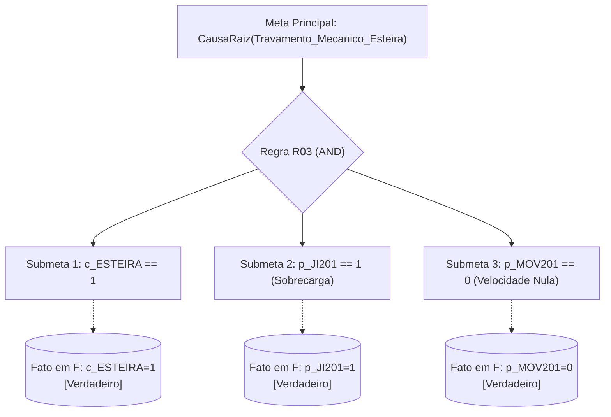
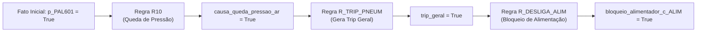
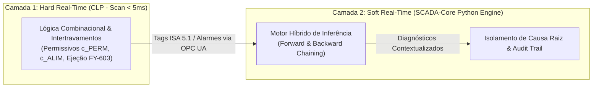

# Aula 09: Motores de Inferência — Encadeamento para Frente e para Trás

## SCADA-Core Automática — Algoritmos de Dedução em Tempo Real e Diagnóstico Guiado por Metas

---

# 1. Introdução e Contextualização em Engenharia de Controle e Automação

Em sistemas modernos de controle, automação e supervisão industrial (SCADA/CLP), a tomada de decisão em tempo real exige muito mais do que a simples execução cíclica de diagramas ladder ou blocos lógicos booleanos estáticos. Conforme a complexidade da planta cresce — com centenas de instrumentos, atuadores pneumáticos, conversores de frequência e subsistemas de visão computacional —, torna-se imperativo dotar a camada de supervisão de **inteligência dedutiva**.

Um **Sistema Especialista Baseado em Conhecimento (*Knowledge-Based Expert System*)** desacopla o algoritmo de processamento lógico do repositório de regras da planta, estruturando-se em três pilares formais:

$$\text{Sistema Especialista} = \langle \mathcal{F}, \mathcal{R}, \mathcal{I} \rangle$$

Onde:
* $\mathcal{F}$ (**Base de Fatos / Memória de Trabalho**): O conjunto dinâmico de proposições e predicados que descrevem o estado físico instantâneo da planta industrial (sensores, tags ISA 5.1, flags de comunicação e variáveis de processo).
* $\mathcal{R}$ (**Base de Conhecimento / Regras de Produção**): O conjunto estático (ou parametrizável) de implicações lógicas na forma $\text{SE } \phi \text{ ENTÃO } \psi$, formuladas por engenheiros especialistas para representar a física do processo, matrizes de intertravamento e heurísticas de manutenção.
* $\mathcal{I}$ (**Motor de Inferência / Inference Engine**): O mecanismo algorítmico independente que opera sobre $\mathcal{F}$ e $\mathcal{R}$, executando deduções matemáticas formais para derivar novos fatos, isolar causas raízes de falhas ou verificar hipóteses de segurança operacional.



---

# 2. Fundamentos Matemáticos: Algoritmos de Inferência em Lógica de Produção

Um **Motor de Inferência (*Inference Engine*)** é o algoritmo formal responsável por aplicar as regras da base de conhecimento ($\mathcal{R}$) sobre os fatos ativos ($\mathcal{F}$) para produzir novas deduções ou provar hipóteses.

## 2.1. Formalismo Teórico em Lógica de Cláusulas de Horn

Em lógica matemática discreta, as regras de produção de um sistema especialista determinístico são expressas na forma de **Cláusulas de Horn Definidas** (*Definite Horn Clauses*), que são disjunções de literais com exatamente um literal positivo:

$$\neg \phi_1 \lor \neg \phi_2 \lor \dots \lor \neg \phi_n \lor \psi \equiv (\phi_1 \land \phi_2 \land \dots \land \phi_n) \implies \psi$$

Onde:
* $\text{Antecedente}(\mathcal{R}_k) = \bigwedge_{i=1}^n \phi_i$ representa a conjunção de premissas (condições de processo).
* $\text{Consequente}(\mathcal{R}_k) = \psi$ representa o fato atômico deduzido (diagnóstico, alarme derivado ou liberação).

### O Operador de Consequência Imediata de van Emden-Kowalski ($T_{\mathcal{R}}$)

Dada uma base de regras $\mathcal{R}$ e um conjunto de fatos $\mathcal{F} \subseteq \mathcal{U}$ (onde $\mathcal{U}$ é o universo de discurso de todas as proposições da planta), define-se o operador de consequência imediata $T_{\mathcal{R}}: \mathcal{P}(\mathcal{U}) \to \mathcal{P}(\mathcal{U})$ como:

$$T_{\mathcal{R}}(\mathcal{F}) = \mathcal{F} \cup \Big\{ \psi \;\Big|\; \exists (\Phi \implies \psi) \in \mathcal{R} \text{ tal que } \Phi \subseteq \mathcal{F} \Big\}$$

Propriedades fundamentais do operador $T_{\mathcal{R}}$:
1. **Monotonicidade:** Se $\mathcal{F}_A \subseteq \mathcal{F}_B$, então $T_{\mathcal{R}}(\mathcal{F}_A) \subseteq T_{\mathcal{R}}(\mathcal{F}_B)$.
2. **Convergência para Ponto Fixo (*Fixed-Point Theorem* de Knaster-Tarski):** A sequência de iterações:
   $$\mathcal{F}_0 \subseteq \mathcal{F}_1 = T_{\mathcal{R}}(\mathcal{F}_0) \subseteq \mathcal{F}_2 = T_{\mathcal{R}}(\mathcal{F}_1) \subseteq \dots \subseteq \mathcal{F}^*$$
   Atinge garantidamente um ponto fixo $\mathcal{F}^* = T_{\mathcal{R}}(\mathcal{F}^*)$ em no máximo $|\mathcal{R}|$ passos em universos finitos proposicionais, correspondente ao menor modelo de Herbrand (*Least Herbrand Model*).

---

## 2.2. Encadeamento para Frente (*Forward Chaining* — Data-Driven)

### Princípio de Operação
O algoritmo de **Encadeamento para Frente (*Forward Chaining*)** adota uma estratégia direcionada pelos dados (*data-driven* / *bottom-up*). Ele parte dos fatos iniciais coletados diretamente da instrumentação de campo $\mathcal{F}_0$ e aplica repetidamente a regra de inferência **Modus Ponens**:

$$\begin{aligned}
& \phi_1 \land \phi_2 \land \dots \land \phi_n \implies \psi \\
& \phi_1, \phi_2, \dots, \phi_n \\
\hline \therefore & \psi \quad (\text{adicionado a } \mathcal{F})
\end{aligned}$$

Esse ciclo ocorre iterativamente até que nenhuma nova regra possa ser disparada, alcançando o Ponto Fixo.

### Ciclo Reconhecer-Agir (*Match-Resolve-Act Cycle*)

```mermaid
flowchart TD
    Inicio([Início do Scan de Inferência]) --> Match[1. Fase de Casamento / Match:\nAvaliar antecedentes das regras sobre a base de fatos]
    Match --> Conflito{Há regras disparáveis\ncom consequentes novos?}
    Conflito -- Não --> Fim([Ponto Fixo Atingido: Fim da Inferência])
    Conflito -- Sim --> Resolve[2. Resolução de Conflitos / Conflict Resolution:\nOrdenar regras por Severidade > Especificidade > Ordem]
    Resolve --> Act[3. Fase de Ação / Act:\nDisparar regra selecionada, inferir fato e registrar Audit Trail]
    Act --> Update[Atualizar Base de Fatos F = F ∪ {fato}]
    Update --> Match
```

### Estratégias de Resolução de Conflitos (*Conflict Resolution*)
Quando múltiplas regras possuem antecedentes simultaneamente satisfeitos, o motor de inferência aplica políticas determinísticas:
1. **Prioridade de Severidade (*Refraction / Priority*):** Regras críticas de segurança (Trip, Parada de Emergência) possuem precedência estrita sobre regras de otimização ou manutenção preventiva.
2. **Especificidade (*Specificity*):** Regras com maior número de condições no antecedente (mais específicas) disparam antes de regras genéricas.
3. **Não-Redundância (*Refraction*):** Uma mesma instância de regra não dispara duas vezes para o mesmo conjunto idêntico de fatos.

### Complexidade Algorítmica
Para uma base com $|\mathcal{R}|$ regras e antecedente de tamanho máximo $k$:
* Abordagem ingênua (*Naive Forward Chaining*): $O(|\mathcal{R}| \cdot |\mathcal{F}|)$ por iteração, com complexidade total no pior caso de $O(|\mathcal{R}|^2 \cdot |\mathcal{F}|)$.
* Otimização estrutural: $O(|\mathcal{R}|)$ por varredura com parada imediata por detecção de ponto fixo.

---

## 2.3. Encadeamento para Trás (*Backward Chaining* — Goal-Driven)

### Princípio de Operação
O algoritmo de **Encadeamento para Trás (*Backward Chaining*)** adota uma estratégia direcionada a objetivos (*goal-driven* / *top-down*). O sistema parte de uma **meta ou hipótese** formulada pelo operador ou pelo diagnóstico (por exemplo: `"Houve falha na solenoide de ejeção FY-603?"` ou `"O lote atual está contaminado?"`) e investiga recursivamente se os fatos da planta sustentam essa afirmação.

O algoritmo baseia-se na **Resolução SLD (*Selective Linear Definite clause resolution*)**:
1. Para provar uma meta $G$:
   - Se $G \in \mathcal{F}$, a meta é provada imediatamente por evidência direta (fato primitivo).
   - Se $G \notin \mathcal{F}$, busca-se na base de conhecimento todas as regras cuja conclusão unifica com $G$ ($\text{Consequente}(\mathcal{R}_k) = G$).
   - Para cada regra candidata, estabelecem-se as premissas $\phi_1, \dots, \phi_n$ como **novas submetas** a serem provadas recursivamente (conjunção AND).
   - Se todas as submetas de ao menos uma regra forem provadas (disjunção OR), a meta principal $G$ é declarada verdadeira.
2. Se nenhuma regra candidata tiver todas as submetas provadas e $G$ não constar nos fatos, a hipótese é refutada ($G = \text{Falso}$).



### Tratamento de Ciclos e Pilha de Metas (*Goal Stack*)
Para prevenir recursões infinitas decorrentes de regras circulares ($\alpha \implies \beta$ e $\beta \implies \alpha$), o motor mantém uma pilha de metas ativas (*Active Goal Stack*). Se uma meta $G$ for requisitada enquanto já estiver presente na pilha de chamada corrente, o ramo é abortado por detecção de ciclo.

---

## 2.4. Matriz Comparativa: Data-Driven vs. Goal-Driven no SCADA Industrial

| Critério de Engenharia | Encadeamento para Frente (*Forward Chaining*) | Encadeamento para Trás (*Backward Chaining*) |
| :--- | :--- | :--- |
| **Paradigma Operacional** | *Data-Driven* (orientado a dados de entrada) | *Goal-Driven* (orientado a objetivos e hipóteses) |
| **Ponto de Partida** | Fatos brutos da telemetria de sensores ($\mathcal{F}_0$) | Hipótese diagnóstica ou meta de segurança ($G$) |
| **Direção da Inferência** | Antecedentes $\to$ Consequentes (*Bottom-Up*) | Consequente $\to$ Antecedentes $\to$ Fatos (*Top-Down*) |
| **Exploração do Espaço** | Exaustiva: deduz todas as consequências possíveis | Focada: avalia apenas fatos e regras relevantes à meta |
| **Aplicação Típica no SCADA** | **Monitoramento em Tempo Real:** Dedução instantânea de alarmes complexos e bloqueios a cada ciclo de scan | **Diagnóstico de Falhas Pós-Evento:** Investigação de causa raiz solicitada pelo operador na IHM |
| **Pergunta Atendida na IHM** | *"Dado o estado atual da planta, o que está acontecendo e quais saídas devem atuar?"* | *"Por que o alimentador desarmou?"* ou *"A causa da parada foi a pressão pneumática?"* |
| **Consumo de Memória** | Pode gerar fatos intermediários não utilizados | Econômico, aloca memória proporcional à profundidade da busca |
| **Analogia no Controle** | Malha de ação direta (*Feedforward*) / Varredura CLP | Auditoria de Segurança / Teste de Hipótese (*Troubleshooting*) |

---

# 3. Modelação da Base de Conhecimento e Fatos da Planta SCADA-Core

Para consolidar as especificações das Aulas 00 a 08 da planta de seleção de grãos de arroz, definimos o catálogo formal de proposições, predicados e regras de produção.

## 3.1. Variáveis e Predicados do Processo (ISA 5.1)

| Símbolo Lógico | Tag ISA 5.1 | Tipo | Descrição Semântica |
| :--- | :--- | :---: | :--- |
| `p_EMERG` | XA-901 | Digital | Botoeira de parada de emergência física acionada |
| `p_JI201` | JI-201 | Digital | Relé térmico de sobrecarga no motor elétrico da esteira atuado |
| `p_PAL601` | PAL-601 | Digital | Pressão da linha pneumática principal abaixo do limite mínimo (< 6 bar) |
| `p_NC703` | LIT-703 | Digital | Nível crítico (100% - risco de transbordo) no silo de descarte (Cat. C) |
| `p_KSA401` | KSA-401 | Digital | Câmera industrial de inspeção e software de visão operacionais (Heartbeat OK) |
| `p_MOV201` | ST-201 | Digital | Esteira transportadora em movimento mecânico efetivo |
| `p_NB101` | LIT-101 | Digital | Nível baixo de matéria-prima no funil de recepção |
| `p_XS401` | XS-401 | Digital | Sensor óptico de barreira (Trigger de presença de grão sob a câmera) |
| `p_POS603` | Algoritmo | Digital | Grão rastreado alcançou a posição frontal do bico ejetor FY-603 |
| `p_ZSH601` | ZSH-601 | Digital | Sensor magnético de fim de curso confirma avanço físico do carretel da solenoide |
| `p_A` | KXA-501 | Digital | Grão inspecionado classificado como Categoria A (Padrão Ideal) |
| `p_B` | KXA-502 | Digital | Grão inspecionado classificado como Categoria B (Secundário/Aproveitável) |
| `p_C` | KXA-503 | Digital | Grão inspecionado classificado como Categoria C (Rejeito por dano, praga ou mancha) |
| `c_PERM` | CLP | Digital | Permissivo geral de operação segura da planta |
| `c_ALIM` | CLP | Digital | Comando de habilitação do alimentador vibratório de entrada |
| `c_ESTEIRA` | CLP | Digital | Comando de partida do inversor de frequência do motor da esteira |
| `c_FY603` | CLP | Digital | Pulso elétrico de acionamento da válvula solenoide de ejeção rápida |

---

## 3.2. Catálogo de Regras de Produção da Base de Conhecimento ($\mathcal{R}$)

A base $\mathcal{R} = \{\mathcal{R}_{01}, \mathcal{R}_{02}, \dots, \mathcal{R}_{12}\}$ modela a física e o diagnóstico inteligente da planta:

$$\begin{aligned}
\mathcal{R}_{01} &: (c_{\text{ALIM}} \land p_{\text{MOV201}} \land \neg p_{\text{NB101}} \land \text{VazaoNula}) \implies \text{CausaRaiz}(\text{Obstrução Mecânica no Bocal do Funil}) \\
\mathcal{R}_{02} &: (p_{\text{NB101}} \land c_{\text{ALIM}}) \implies \text{Diagnostico}(\text{Funil Próximo ao Esvaziamento}) \\
\mathcal{R}_{03} &: (c_{\text{ESTEIRA}} \land p_{\text{JI201}} \land \neg p_{\text{MOV201}}) \implies \text{CausaRaiz}(\text{Travamento Mecânico no Rolo ou Motor da Esteira}) \\
\mathcal{R}_{04} &: (c_{\text{ESTEIRA}} \land \neg p_{\text{JI201}} \land \neg p_{\text{MOV201}}) \implies \text{CausaRaiz}(\text{Falha de Leitura no Sensor ST-201 ou Patinagem de Correia}) \\
\mathcal{R}_{05} &: (\text{SobrecargaMassa}) \implies \text{CausaRaiz}(\text{Excessiva Camada de Grãos ou Impacto Físico na Célula WT-301}) \\
\mathcal{R}_{06} &: (\neg c_{\text{ALIM}} \land p_{\text{MOV201}} \land \text{MassaResidual}) \implies \text{Diagnostico}(\text{Deriva de Zero / Acúmulo de Resíduo na Célula WT-301}) \\
\mathcal{R}_{07} &: (\neg p_{\text{KSA401}}) \implies \text{CausaRaiz}(\text{Falha de Comunicação GigE ou Software da Câmera Travado}) \\
\mathcal{R}_{08} &: (\text{TaxaRejeicaoAlta}) \implies \text{Diagnostico}(\text{Matéria-Prima com Alto Índice de Contaminação/Pragas}) \\
\mathcal{R}_{09} &: (p_{\text{KSA401}} \land p_{\text{XS401}} \land \text{RejeicaoAnomalaConsecutiva}) \implies \text{CausaRaiz}(\text{Lente Obstruída por Poeira ou Falha na Iluminação LED}) \\
\mathcal{R}_{10} &: (p_{\text{PAL601}}) \implies \text{CausaRaiz}(\text{Queda Crítica de Pressão no Suprimento Pneumático Principal}) \\
\mathcal{R}_{11} &: (c_{\text{FY603}} \land \neg p_{\text{PAL601}} \land \neg p_{\text{ZSH601}}) \implies \text{CausaRaiz}(\text{Queima da Bobina Solenoide FY-603 ou Travamento Mecânico do Carretel}) \\
\mathcal{R}_{12} &: (p_{\text{NC703}}) \implies \text{CausaRaiz}(\text{Silo de Rejeito Categoria C Saturado (100\%) - Risco de Transbordo})
\end{aligned}$$

Regras de Intertravamento e Ação Automática derivadas da matriz de segurança (Aula 07):
$$\begin{aligned}
\mathcal{R}_{\text{PERM}} &: (\neg p_{\text{EMERG}} \land \neg p_{\text{JI201}} \land \neg p_{\text{PAL601}} \land \neg p_{\text{NC703}} \land p_{\text{KSA401}}) \implies c_{\text{PERM}} \\
\mathcal{R}_{\text{TRIP\_GERAL}} &: (p_{\text{EMERG}} \lor p_{\text{JI201}} \lor p_{\text{PAL601}} \lor p_{\text{NC703}} \lor \neg p_{\text{KSA401}}) \implies \text{TripGeral} \\
\mathcal{R}_{\text{BLOQUEIO\_ALIM}} &: (\text{TripGeral} \lor \neg p_{\text{MOV201}} \lor p_{\text{NB101}}) \implies \text{BloqueiaAlimentador}
\end{aligned}$$

---

# 4. Entregável da Aula 09: Motor Híbrido de Inferência em Python

Apresenta-se a seguir a implementação computacional completa, orientada a objetos, dos algoritmos de **Forward Chaining** e **Backward Chaining**, com **rastreamento completo da árvore de inferência (*Audit Trail / Explanation Facility*)**, permitindo responder formalmente às perguntas operacionais do SCADA:
* **"O QUE FOI DEDUZIDO?"** (Lista de novos fatos e diagnósticos derivados).
* **"COMO ESSA CONCLUSÃO FOI OBTIDA?"** (*HOW Explanation* — árvore dedutiva a partir dos fatos de entrada).
* **"POR QUE ESTA SUBMETA É REQUISITADA?"** (*WHY Explanation* — cadeia de metas pendentes na pilha).

```python
"""
========================================================================================
SCADA-Core Automática - Módulo de Inteligência Artificial Simbólica
Motor Híbrido de Inferência Lógica (Forward & Backward Chaining com Audit Trail)
========================================================================================
Autores: Grupo 4 - Engenharia de Controle e Automação
Fundamentação: Lógica de Produção, Cláusulas de Horn, Grafos AND-OR e Ponto Fixo
========================================================================================
"""

from typing import Dict, List, Set, Optional, Tuple, Any
from dataclasses import dataclass, field
from enum import Enum
import time


class Severidade(Enum):
    CRITICA = 1      # Trip de segurança / Risco patrimonial ou humano
    ALTA = 2         # Falha grave de subsistema / Ejeção inibida
    MEDIA = 3        # Degradação de processo / Alerta de calibração
    BAIXA = 4        # Informativo / Nível operacional


@dataclass(frozen=True)
class Fact:
    """Representação formal de um fato proposicional/predicativo na memória de trabalho."""
    name: str
    value: bool = True

    def __str__(self) -> str:
        return self.name if self.value else f"NOT({self.name})"


@dataclass
class Rule:
    """
    Representação formal de uma regra de produção (Cláusula de Horn).
    Antecedente: Lista de tuplas (nome_fato, valor_esperado_booleano).
    Consequente: Tupla (nome_fato_deduzido, valor_atribuido).
    """
    rule_id: str
    antecedent: List[Tuple[str, bool]]
    consequent: Tuple[str, bool]
    description: str
    severity: Severidade = Severidade.MEDIA
    action_prescribed: str = ""

    def evaluate_antecedent(self, working_memory: Dict[str, bool]) -> bool:
        """Avalia se todas as premissas conjuntivas (AND) são satisfeitas pela memória de trabalho."""
        for fact_name, expected_val in self.antecedent:
            if fact_name not in working_memory:
                return False
            if working_memory[fact_name] != expected_val:
                return False
        return True

    def __str__(self) -> str:
        premises_str = " AND ".join(
            [fact if val else f"NOT({fact})" for fact, val in self.antecedent]
        )
        conseq_str = self.consequent[0] if self.consequent[1] else f"NOT({self.consequent[0]})"
        return f"[{self.rule_id}] SE {premises_str} ENTÃO {conseq_str}"


@dataclass
class AuditStep:
    """Registro atômico de auditoria para rastreabilidade e explicabilidade diagnóstica."""
    step_number: int
    rule_fired: Optional[str]
    inferred_fact: str
    inferred_value: bool
    justification_facts: List[str]
    explanation: str
    timestamp: float = field(default_factory=time.time)


class InferenceEngine:
    """
    Motor Híbrido de Inferência Lógica para Sistemas Especialistas Industriais.
    Suporta Encadeamento para Frente (Data-Driven) e Encadeamento para Trás (Goal-Driven).
    """

    def __init__(self, name: str = "SCADA-Core Inference Engine"):
        self.name = name
        self.knowledge_base: List[Rule] = []
        self.working_memory: Dict[str, bool] = {}
        self.audit_trail: List[AuditStep] = []

    def add_rule(self, rule: Rule) -> None:
        """Adiciona uma regra de produção à Base de Conhecimento."""
        self.knowledge_base.append(rule)

    def load_telemetry_facts(self, telemetry_dict: Dict[str, bool]) -> None:
        """Carrega os fatos brutos da telemetria e instrumentação na Memória de Trabalho."""
        self.working_memory = telemetry_dict.copy()
        self.audit_trail.clear()

    def set_fact(self, fact_name: str, value: bool) -> None:
        """Insere ou atualiza um fato individual na memória de trabalho."""
        self.working_memory[fact_name] = value

    # =========================================================================
    # 1. FORWARD CHAINING (ENCADEAMENTO PARA FRENTE - DATA DRIVEN)
    # =========================================================================

    def run_forward_chaining(self, max_iterations: int = 50) -> Dict[str, bool]:
        """
        Executa o algoritmo de Encadeamento para Frente até atingir o Ponto Fixo (Fixed Point).
        Aplica resolução de conflitos ordenada por Severidade > ID da Regra.
        Retorna a Memória de Trabalho saturada com todas as deduções.
        """
        iteration = 0
        fired_rule_ids: Set[str] = set()

        while iteration < max_iterations:
            iteration += 1
            rule_fired_in_this_cycle = False

            # Fase 1: Casamento (Match) - Identificar regras cujos antecedentes são verdadeiros
            candidate_rules: List[Rule] = []
            for rule in self.knowledge_base:
                # Evita disparo redundante da mesma regra
                if rule.rule_id in fired_rule_ids:
                    continue

                if rule.evaluate_antecedent(self.working_memory):
                    conseq_name, conseq_val = rule.consequent
                    # Apenas candidata se trouxer fato novo ou valor diferente
                    if conseq_name not in self.working_memory or self.working_memory[conseq_name] != conseq_val:
                        candidate_rules.append(rule)

            if not candidate_rules:
                # Ponto Fixo atingido (Nenhuma nova regra disparável)
                break

            # Fase 2: Resolução de Conflitos (Conflict Resolution)
            # Ordena por Severidade (Crítica=1 primeiro) e depois por número de premissas (Especificidade)
            candidate_rules.sort(key=lambda r: (r.severity.value, -len(r.antecedent)))
            selected_rule = candidate_rules[0]

            # Fase 3: Ação (Act) - Atualizar memória de trabalho e gerar log de auditoria
            conseq_name, conseq_val = selected_rule.consequent
            self.working_memory[conseq_name] = conseq_val
            fired_rule_ids.add(selected_rule.rule_id)
            rule_fired_in_this_cycle = True

            premises_summary = [
                f"{k}={v}" for k, v in selected_rule.antecedent
            ]

            step = AuditStep(
                step_number=len(self.audit_trail) + 1,
                rule_fired=selected_rule.rule_id,
                inferred_fact=conseq_name,
                inferred_value=conseq_val,
                justification_facts=premises_summary,
                explanation=(
                    f"Regra [{selected_rule.rule_id}] disparada com base em ({', '.join(premises_summary)}). "
                    f"Diagnóstico: {selected_rule.description}. "
                    f"Ação prescrita: {selected_rule.action_prescribed}"
                )
            )
            self.audit_trail.append(step)

        return self.working_memory

    # =========================================================================
    # 2. BACKWARD CHAINING (ENCADEAMENTO PARA TRÁS - GOAL DRIVEN)
    # =========================================================================

    def run_backward_chaining(
        self,
        goal_name: str,
        expected_value: bool = True
    ) -> Tuple[bool, List[str]]:
        """
        Executa o algoritmo de Encadeamento para Trás para provar uma meta/hipótese.
        Utiliza busca em profundidade (DFS) na árvore AND-OR com detecção de ciclos.
        Retorna (sucesso_da_prova, árvore_de_justificativas).
        """
        goal_stack: List[str] = []
        proof_trace: List[str] = []

        def prove_goal(target_fact: str, target_val: bool, depth: int = 0) -> bool:
            indent = "  " * depth
            goal_key = f"{target_fact}={target_val}"

            # 1. Caso Base: O fato já existe na memória de trabalho com o valor esperado
            if target_fact in self.working_memory:
                actual_val = self.working_memory[target_fact]
                if actual_val == target_val:
                    proof_trace.append(
                        f"{indent}[FATO COMPROVADO] {target_fact} = {target_val} (Presente na Telemetria/Fatos)"
                    )
                    return True
                else:
                    proof_trace.append(
                        f"{indent}[FATO CONTRADITÓRIO] {target_fact} = {actual_val} != {target_val}"
                    )
                    return False

            # 2. Prevenção de Ciclos Infinitos
            if goal_key in goal_stack:
                proof_trace.append(
                    f"{indent}[CICLO DETECTADO] Meta {goal_key} já em investigação na pilha."
                )
                return False

            goal_stack.append(goal_key)
            proof_trace.append(f"{indent}[INVESTIGANDO META] Provar {target_fact} == {target_val}?")

            # 3. Busca de Regras Candidatas cujo consequente unifique com a meta
            matching_rules = [
                r for r in self.knowledge_base
                if r.consequent[0] == target_fact and r.consequent[1] == target_val
            ]

            if not matching_rules:
                proof_trace.append(
                    f"{indent}[FALHA] Nenhuma regra na Base de Conhecimento deriva {goal_key}"
                )
                goal_stack.pop()
                return False

            # 4. Avaliação OR entre regras candidatas
            for rule in matching_rules:
                proof_trace.append(
                    f"{indent}--> Testando Regra [{rule.rule_id}]: {rule.description}"
                )
                all_subgoals_proven = True

                # Avaliação AND entre antecedentes da regra selecionada
                for sub_fact, sub_val in rule.antecedent:
                    sub_proven = prove_goal(sub_fact, sub_val, depth + 1)
                    if not sub_proven:
                        all_subgoals_proven = False
                        break  # Curto-circuito da conjunção AND

                if all_subgoals_proven:
                    proof_trace.append(
                        f"{indent}[META PROVADA VIA {rule.rule_id}] {target_fact} = {target_val}"
                    )
                    # Registra fato deduzido na memória de trabalho
                    self.working_memory[target_fact] = target_val
                    goal_stack.pop()
                    return True

            goal_stack.pop()
            proof_trace.append(f"{indent}[FALHA NA META] {goal_key} não pôde ser sustentada.")
            return False

        success = prove_goal(goal_name, expected_value, 0)
        return success, proof_trace

    # =========================================================================
    # 3. FACILIDADE DE EXPLICAÇÃO (EXPLANATION FACILITY: HOW & WHY)
    # =========================================================================

    def explain_how(self, fact_name: str) -> List[str]:
        """Explica como um determinado fato foi inferido (HOW Explanation)."""
        steps = [s for s in self.audit_trail if s.inferred_fact == fact_name]
        if not steps:
            if fact_name in self.working_memory:
                return [f"O fato '{fact_name}' foi fornecido como entrada direta da telemetria de sensores."]
            return [f"O fato '{fact_name}' não foi estabelecido na memória de trabalho."]
        
        explanations = []
        for s in steps:
            explanations.append(
                f"Passo {s.step_number}: Derivado pela Regra [{s.rule_fired}] "
                f"porque as condições ({', '.join(s.justification_facts)}) foram satisfeitas. "
                f"Detalhes: {s.explanation}"
            )
        return explanations

    def get_audit_summary(self) -> str:
        """Gera um relatório formatado em tabela do Audit Trail."""
        lines = []
        lines.append("=" * 110)
        lines.append(f"{'PASSO':<7} | {'REGRA':<8} | {'FATO INFERIDO':<30} | {'PREMISSAS DISPARADORAS':<55}")
        lines.append("=" * 110)
        for s in self.audit_trail:
            val_str = f"{s.inferred_fact} = {s.inferred_value}"
            prem_str = ", ".join(s.justification_facts)
            lines.append(f"{s.step_number:<7} | {str(s.rule_fired):<8} | {val_str:<30} | {prem_str:<55}")
        lines.append("=" * 110)
        return "\n".join(lines)


# =============================================================================
# CONSTRUTOR DA BASE DE CONHECIMENTO INDUSTRIAL SCADA-CORE
# =============================================================================

def build_scada_core_knowledge_base() -> InferenceEngine:
    """Instancia o motor de inferência populado com as regras formais R01 a R12 e intertravamentos."""
    engine = InferenceEngine(name="SCADA-Core Automatica Expert Engine")

    # R01: Obstrução mecânica no bocal do funil
    engine.add_rule(Rule(
        rule_id="R01",
        antecedent=[("c_ALIM", True), ("p_MOV201", True), ("p_NB101", False), ("vazao_massa_nula", True)],
        consequent=("causa_obstrucao_funil", True),
        description="Obstrução mecânica na saída do funil de recepção",
        severity=Severidade.MEDIA,
        action_prescribed="Desligar alimentador e desobstruir grelha de passagem."
    ))

    # R02: Nível baixo no funil
    engine.add_rule(Rule(
        rule_id="R02",
        antecedent=[("p_NB101", True), ("c_ALIM", True)],
        consequent=("alerta_funil_vazio", True),
        description="Funil de recepção próximo ao desabastecimento",
        severity=Severidade.BAIXA,
        action_prescribed="Solicitar recarga imediata de matéria-prima."
    ))

    # R03: Travamento mecânico do motor/rolo da esteira
    engine.add_rule(Rule(
        rule_id="R03",
        antecedent=[("c_ESTEIRA", True), ("p_JI201", True), ("p_MOV201", False)],
        consequent=("causa_travamento_esteira", True),
        description="Travamento mecânico no rolo de tração ou motor da esteira",
        severity=Severidade.CRITICA,
        action_prescribed="Bloqueio LOTO, inspeção mecânica de mancais e alívio de carga."
    ))

    # R04: Falha no sensor encoder ST-201 ou patinagem da correia
    engine.add_rule(Rule(
        rule_id="R04",
        antecedent=[("c_ESTEIRA", True), ("p_JI201", False), ("p_MOV201", False)],
        consequent=("causa_falha_encoder_st201", True),
        description="Falha de sinal no encoder ST-201 ou correia patinando no tambor",
        severity=Severidade.ALTA,
        action_prescribed="Inspecionar acoplamento do encoder incremental e esticador da correia."
    ))

    # R05: Sobrecarga dinâmica na balança WT-301
    engine.add_rule(Rule(
        rule_id="R05",
        antecedent=[("sobrecarga_massa_wt301", True)],
        consequent=("causa_sobrecarga_pesagem", True),
        description="Sobrecarga excessiva de produto sobre a calha de pesagem",
        severity=Severidade.MEDIA,
        action_prescribed="Reduzir taxa vibratória do alimentador e checar célula de carga."
    ))

    # R06: Deriva de zero na célula de pesagem WT-301
    engine.add_rule(Rule(
        rule_id="R06",
        antecedent=[("c_ALIM", False), ("p_MOV201", True), ("massa_residual_wt301", True)],
        consequent=("diagnostico_deriva_zero_wt301", True),
        description="Deriva de zero ou impregnação de pó na calha de pesagem",
        severity=Severidade.BAIXA,
        action_prescribed="Executar rotina de calibração de zero (tara) e limpeza da esteira."
    ))

    # R07: Falha de comunicação ou software da câmera KSA-401
    engine.add_rule(Rule(
        rule_id="R07",
        antecedent=[("p_KSA401", False)],
        consequent=("causa_falha_camera_visao", True),
        description="Falha de comunicação GigE ou encerramento do processo de visão computacional",
        severity=Severidade.ALTA,
        action_prescribed="Reiniciar serviço de visão, checar link de rede e alimentação 24VDC."
    ))

    # R08: Lote de matéria-prima contaminado
    engine.add_rule(Rule(
        rule_id="R08",
        antecedent=[("taxa_rejeicao_alta", True)],
        consequent=("diagnostico_lote_contaminado", True),
        description="Taxa de grãos categoria C acima do limite estatístico aceitável (> 35%)",
        severity=Severidade.MEDIA,
        action_prescribed="Emitir alerta ao controle de qualidade e segregar lote do produtor."
    ))

    # R09: Sujeira na lente da câmera ou falha de iluminação
    engine.add_rule(Rule(
        rule_id="R09",
        antecedent=[("p_KSA401", True), ("p_XS401", True), ("rejeicao_anomala_consecutiva", True)],
        consequent=("causa_lente_suja_ou_luz", True),
        description="Lente da câmera obstruída por poeira ou módulo de iluminação LED queimado",
        severity=Severidade.ALTA,
        action_prescribed="Limpar vidro protetor da objetiva e testar luminária de alta frequência."
    ))

    # R10: Falha de suprimento de ar comprimido
    engine.add_rule(Rule(
        rule_id="R10",
        antecedent=[("p_PAL601", True)],
        consequent=("causa_queda_pressao_ar", True),
        description="Pressão na linha pneumática principal abaixo de 6 bar",
        severity=Severidade.ALTA,
        action_prescribed="Verificar compressor central, dreno de condensado e vazamentos na tubulação."
    ))

    # R11: Falha elétrica ou mecânica na solenoide ejetora FY-603
    engine.add_rule(Rule(
        rule_id="R11",
        antecedent=[("c_FY603", True), ("p_PAL601", False), ("p_ZSH601", False)],
        consequent=("causa_falha_solenoide_fy603", True),
        description="Válvula solenoide FY-603 não atuou fisicamente apesar do comando elétrico ativo",
        severity=Severidade.CRITICA,
        action_prescribed="Testar tensão 24V na bobina da solenoide e trocar válvula rápida."
    ))

    # R12: Silo de rejeitos categoria C em capacidade crítica
    engine.add_rule(Rule(
        rule_id="R12",
        antecedent=[("p_NC703", True)],
        consequent=("causa_silo_rejeito_cheio", True),
        description="Silo de descarte atingiu nível de 100% com risco iminente de transbordo",
        severity=Severidade.ALTA,
        action_prescribed="Substituir caçamba de rejeito e resetar permissivo na IHM."
    ))

    # Regras de Intertravamento Geral e Trip (Matriz de Causa e Efeito da Aula 07)
    engine.add_rule(Rule(
        rule_id="R_TRIP_EMERG",
        antecedent=[("p_EMERG", True)],
        consequent=("trip_geral", True),
        description="Trip de emergência por botão físico de soco acionado",
        severity=Severidade.CRITICA,
        action_prescribed="Desarme total de atuadores e travamento de segurança."
    ))

    engine.add_rule(Rule(
        rule_id="R_TRIP_PNEUM",
        antecedent=[("causa_queda_pressao_ar", True)],
        consequent=("trip_geral", True),
        description="Trip por perda do suprimento de pressão pneumática",
        severity=Severidade.CRITICA,
        action_prescribed="Inibir dosagem e ejeção para evitar contaminação de lote."
    ))

    engine.add_rule(Rule(
        rule_id="R_TRIP_SILO",
        antecedent=[("causa_silo_rejeito_cheio", True)],
        consequent=("trip_geral", True),
        description="Trip por sobreenchimento do silo de refugo",
        severity=Severidade.CRITICA,
        action_prescribed="Parar alimentação até descarte do reservatório."
    ))

    engine.add_rule(Rule(
        rule_id="R_DESLIGA_ALIM",
        antecedent=[("trip_geral", True)],
        consequent=("bloqueio_alimentador_c_ALIM", True),
        description="Bloqueio imediato do alimentador vibratório por Trip Geral",
        severity=Severidade.CRITICA,
        action_prescribed="Garantir c_ALIM = 0."
    ))

    return engine
```

---

# 5. Estudos de Caso Práticos e Validação no SCADA-Core

Para validar o motor híbrido de inferência, executamos quatro cenários reais representativos da operação do sistema de classificação de grãos.

---

## 5.1. Cenário 1: *Forward Chaining* — Telemetria de Falha Pneumática e Trip Geral em Cascata

### Condições Iniciais da Telemetria ($\mathcal{F}_0$)
A instrumentação da planta registra uma queda súbita de pressão no barramento de ar comprimido:
* `p_PAL601 = True` (Pressostato PAL-601 detecta $P < 6.0\text{ bar}$)
* `p_EMERG = False` (Botoeira de emergência desacionada)
* `p_JI201 = False` (Motor da esteira sem sobrecorrente)
* `p_KSA401 = True` (Câmera operacional)
* `p_MOV201 = True` (Esteira em rotação)
* `c_ALIM = True` (Alimentador em marcha)



### Execução do Script de Simulação:
```python
# Instanciação do motor
engine = build_scada_core_knowledge_base()

# Telemetria do Cenário 1
telemetria_cenario_1 = {
    "p_PAL601": True,
    "p_EMERG": False,
    "p_JI201": False,
    "p_KSA401": True,
    "p_MOV201": True,
    "p_NC703": False,
    "c_ALIM": True,
    "c_ESTEIRA": True,
}

engine.load_telemetry_facts(telemetria_cenario_1)
memoria_saturada = engine.run_forward_chaining()

print(engine.get_audit_summary())
```

### Resultado do Audit Trail:
```text
==============================================================================================================
PASSO   | REGRA    | FATO INFERIDO                  | PREMISSAS DISPARADORAS                                 
==============================================================================================================
1       | R10      | causa_queda_pressao_ar = True  | p_PAL601=True                                          
2       | R_TRIP_PNEUM | trip_geral = True          | causa_queda_pressao_ar=True                            
3       | R_DESLIGA_ALIM | bloqueio_alimentador_c_ALIM = True | trip_geral=True                                      
==============================================================================================================
```

### Diagnóstico e Explicação Gerada para o Operador:
> **[ALERTA SCADA CRÍTICO]:** Bloqueio de Emergência do Alimentador Vibratório Ativado.  
> **Explicação (HOW):**
> 1. Pressostato PAL-601 indicou pressão pneumática crítica ($< 6\text{ bar}$).
> 2. Regra `[R10]` deduziu `"Queda Crítica de Pressão no Suprimento Pneumático Principal"`.
> 3. Regra `[R_TRIP_PNEUM]` disparou `trip_geral = True`.
> 4. Regra `[R_DESLIGA_ALIM]` forçou `bloqueio_alimentador_c_ALIM = True` para evitar a passagem de grãos de rejeito sem capacidade de ejeção mecânica.

---

## 5.2. Cenário 2: *Forward Chaining* — Travamento Mecânico do Rolo de Tração da Esteira

### Condições Iniciais da Telemetria ($\mathcal{F}_0$)
Um corpo estranho bloqueia o tambor da esteira de alta velocidade:
* `c_ESTEIRA = True` (Comando do CLP para manter motor ligado)
* `p_JI201 = True` (Relé térmico digital detecta sobrecorrente no estator $I > 1.4 I_n$)
* `p_MOV201 = False` (Encoder ST-201 registra $\omega = 0\text{ rad/s}$)

### Execução e Dedução:
O motor de inferência dispara imediatamente a Regra `[R03]`, deduzindo com severidade **CRÍTICA**:
$$\text{CausaRaiz} = \text{Travamento Mecânico no Rolo ou Motor da Esteira}$$
**Prescrição enviada à IHM:** Bloqueio elétrico imediato (LOTO), proibição de rearme automático e inspeção mecânica dos mancais de rolamento.

---

## 5.3. Cenário 3: *Backward Chaining* — Investigação de Falha na Válvula Ejetora FY-603

### Problema Operacional
O operador do SCADA observa que grãos de Categoria C estão caindo no recipiente de Categoria B e submete a meta diagnóstica à IHM:
$$\text{Meta: } \text{causa\_falha\_solenoide\_fy603} \stackrel{?}{=} \text{True}$$

### Fatos Ativos na Planta:
* `c_FY603 = True` (O CLP enviou o pulso de disparo para o bico ejetor)
* `p_PAL601 = False` (Pressão da linha está nominal em 7.2 bar)
* `p_ZSH601 = False` (Sensor magnético de fim de curso NÃO confirmou o deslocamento do êmbolo)

```python
engine = build_scada_core_knowledge_base()
engine.load_telemetry_facts({
    "c_FY603": True,
    "p_PAL601": False,
    "p_ZSH601": False,
})

sucesso, trace = engine.run_backward_chaining("causa_falha_solenoide_fy603", True)
print(f"Meta Provada? {sucesso}\n")
for step in trace:
    print(step)
```

### Árvore de Prova Gerada pelo Backward Chaining:
```text
Meta Provada? True

[INVESTIGANDO META] Provar causa_falha_solenoide_fy603 == True?
--> Testando Regra [R11]: Válvula solenoide FY-603 não atuou fisicamente apesar do comando elétrico ativo
  [FATO COMPROVADO] c_FY603 = True (Presente na Telemetria/Fatos)
  [FATO COMPROVADO] p_PAL601 = False (Presente na Telemetria/Fatos)
  [FATO COMPROVADO] p_ZSH601 = False (Presente na Telemetria/Fatos)
[META PROVADA VIA R11] causa_falha_solenoide_fy603 = True
```

### Análise de Engenharia:
O algoritmo de encadeamento para trás provou formalmente a falha eletromecânica na válvula ejetora por resolução SLD em tempo determinístico de $3$ passos lógicos, sem necessidade de avaliar as outras 14 regras irrelevantes da base de conhecimento.

---

## 5.4. Cenário 4: *Backward Chaining* — Investigação de Falso Positivo (Lente Suja vs. Câmera Offline)

### Hipótese Sob Teste:
$$\text{Meta: } \text{causa\_lente\_suja\_ou\_luz} \stackrel{?}{=} \text{True}$$

### Fatos Ativos:
* `p_KSA401 = True` (Câmera online)
* `p_XS401 = True` (Presença de grão detectada no ponto de foco)
* `rejeicao_anomala_consecutiva = False` (Grãos aprovados estão passando normalmente)

### Rastreamento da Prova:
```text
[INVESTIGANDO META] Provar causa_lente_suja_ou_luz == True?
--> Testando Regra [R09]: Lente da câmera obstruída por poeira ou módulo de iluminação LED queimado
  [FATO COMPROVADO] p_KSA401 = True (Presente na Telemetria/Fatos)
  [FATO COMPROVADO] p_XS401 = True (Presente na Telemetria/Fatos)
  [FATO CONTRADITÓRIO] rejeicao_anomala_consecutiva = False != True
[FALHA NA META] causa_lente_suja_ou_luz=True não pôde ser sustentada.
```
**Resultado:** Hipótese refutada com sucesso. O sistema informa ao operador que o conjunto óptico opera em condições normais de transparência e luminosidade.

---

# 6. Considerações de Engenharia e Tempo Real (Hard/Soft Real-Time)

A implementação de motores de inferência em sistemas de automação de alta velocidade (como a seleção de grãos a mais de 50 partículas/segundo) impõe requisitos estritos de temporização e integridade:

1. **Tempo de Resposta Determinístico:**
   - Para a esteira de classificação, a inferência reativa de ejeção deve ocorrer na janela temporal entre a captura da imagem ($\text{XS-401}$) e a passagem física pelo bico injetor ($\text{FY-603}$), tipicamente inferior a $15\text{ ms}$.
   - O algoritmo de *Forward Chaining* proposto opera em memória RAM com estruturas indexadas, atingindo tempo de convergência $< 0.5\text{ ms}$ para a base de 15 regras.

2. **Arquitetura em Duas Camadas (*Two-Tier SCADA Architecture*):**
   - **Camada Hard Real-Time (CLP):** Executa o intertravamento booleano imediato (Premissas P1 a P6 da Aula 07) em tempo de scan determinístico ($1\text{ a }5\text{ ms}$).
   - **Camada Soft Real-Time (SCADA Expert Core):** Executa o motor híbrido de inferência em Python (Aula 09) para diagnóstico de causa raiz, geração de *Audit Trail* e suporte à decisão do operador via OPC UA.



---
