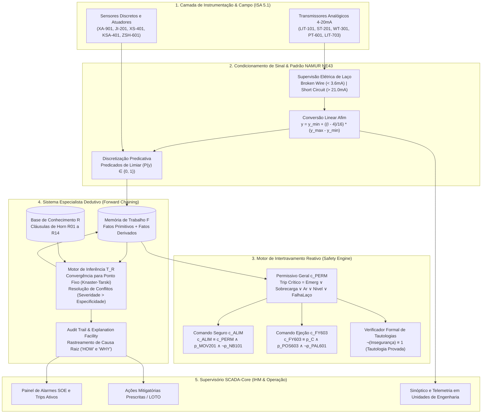

# Aula 10: Avaliação Integrada do Módulo 1 — Motor de Intertravamento e Diagnóstico

## SCADA-Core Automática — Grupo 04: Sistema Automatizado de Classificação e Seleção de Grãos por Visão Computacional

**Estudante com Foco em Matemática Discreta e Teoria da Computação**  
**Módulo 1:** Lógica Formal & Sistemas Especialistas Aplicados à Engenharia de Automação

---

# 1. Escopo e Diretrizes do Desafio de Engenharia

Nesta avaliação integradora, consolidamos as bases formais, matemáticas e computacionais desenvolvidas ao longo das Aulas 00 a 09 para o sistema de supervisão e controle da planta de seleção e classificação óptica de grãos (arroz). O objetivo central é demonstrar a sinergia absoluta entre a teoria da **Matemática Discreta** e a **Engenharia de Automação de Alta Confiabilidade**, garantindo que as tomadas de decisão críticas do sistema sejam matematicamente verificáveis, imunes a estados proibidos e explicáveis em tempo de execução.

O escopo integrador unifica três pilares fundamentais:
1. **Catálogo e Telemetria de *Tags* ISA-5.1 com Conversão e Validação 4–20 mA (Padrão NAMUR NE43):** Transição formal do domínio contínuo analógico ($\mathbb{R}$) para o universo proposicional discreto ($\mathbb{B} = \{0, 1\}$), implementando detecção precoce de falhas elétricas de instrumentação (rompimento de condutor, saturação e curto-circuito).
2. **Motor de Intertravamento e Prova Formal de Tautologias de Segurança:** Implementação dos blocos de permissivos e intertravamentos de segurança operacional, acompanhados de provas dedutivas formais (Dedução Natural, *Reductio ad Absurdum* e Tabela-Verdade exaustiva $2^n$), demonstrando analiticamente que situações de perigo físico são teoremas invioláveis.
3. **Base de Conhecimento Especialista e Motor de Inferência *Forward Chaining*:** Execução do algoritmo orientado a dados (*data-driven*) em Cláusulas de Horn com resolução de conflitos por severidade e garantia de terminação monotônica pelo Teorema do Ponto Fixo de Knaster-Tarski (Operador de van Emden-Kowalski $T_{\mathcal{R}}$), gerando rastreabilidade completa de auditoria (*Audit Trail* / SOE).

---

# 2. Catálogo de Instrumentação ISA-5.1 e Telemetria com Conversão 4–20 mA

Em plantas industriais de automação contínua e discreta, a instrumentação primária comunica-se com a camada de controle (CLP/SCADA) majoritariamente por meio do padrão analógico de corrente **4–20 mA** (normatizado pela IEC 60381-1). Para um estudante de matemática discreta, este subsistema representa uma **transformação funcional afim** entre um intervalo compacto contínuo dos reais e o espaço amostral discreto de proposições booleanas.

## 2.1. Formalismo Matemático da Conversão de Unidades de Engenharia

Seja $I \in \mathbb{R}$ o valor de corrente elétrica medido pelo conversor A/D do CLP, em miliamperes ($\text{mA}$), no intervalo de operação normal $[I_{\min}, I_{\max}] = [4.0, 20.0]\text{ mA}$. A grandeza física real $y \in [y_{\min}, y_{\max}]$, expressa em **Unidades de Engenharia ($EU$)**, é obtida pela bijeção linear afim:

$$y = f(I) = y_{\min} + \left( \frac{I - I_{\min}}{I_{\max} - I_{\min}} \right) (y_{\max} - y_{\min}) = y_{\min} + \left( \frac{I - 4.0}{16.0} \right) (y_{\max} - y_{\min})$$

A função inversa, utilizada para simular a resposta do transmissor em bancada de testes, é dada por:

$$I = f^{-1}(y) = 4.0 + 16.0 \cdot \left( \frac{y - y_{\min}}{y_{\max} - y_{\min}} \right)$$

## 2.2. Supervisão de Integridade Elétrica de Laço (Padrão NAMUR NE43)

A adoção do "zero vivo" ($4.0\text{ mA}$) permite distinguir matematicamente uma medição de processo nula ($y = y_{\min}$) de uma quebra física no laço elétrico. Adotamos formalmente o padrão internacional **NAMUR NE43**, particionando a reta real da corrente $\mathbb{R}^+$ em cinco conjuntos disjuntos de estados operacionais:

$$\begin{aligned}
\mathcal{S}_{\text{BrokenWire}} &= \{ I \in \mathbb{R} \mid I < 3.6\text{ mA} \} && \implies \text{Rompimento de condutor elétrico ou cabo desconectado} \\
\mathcal{S}_{\text{UnderRange}} &= \{ I \in \mathbb{R} \mid 3.6\text{ mA} \le I < 3.8\text{ mA} \} && \implies \text{Saturação inferior / Erro de calibração de zero} \\
\mathcal{S}_{\text{Normal}}     &= \{ I \in \mathbb{R} \mid 3.8\text{ mA} \le I \le 20.5\text{ mA} \} && \implies \text{Regime normal de medição válida do processo} \\
\mathcal{S}_{\text{OverRange}}  &= \{ I \in \mathbb{R} \mid 20.5\text{ mA} < I \le 21.0\text{ mA} \} && \implies \text{Saturação superior / Sobrecarga de processo} \\
\mathcal{S}_{\text{ShortCircuit}} &= \{ I \in \mathbb{R} \mid I > 21.0\text{ mA} \} && \implies \text{Curto-circuito na fiação ou falha interna do sensor}
\end{aligned}$$

Definimos a proposição booleana de falha intrínseca de instrumentação para qualquer canal analógico $x$:

$$\text{FalhaLaço}(x) \iff (I_x < 3.6\text{ mA}) \lor (I_x > 21.0\text{ mA})$$

A ocorrência de $\text{FalhaLaço}(x)$ ativa imediatamente a proteção *fail-safe*, impossibilitando a continuidade da operação da planta com leituras corrompidas.

## 2.3. Catálogo de Instrumentação e Quantização em Proposições Lógicas

O mapeamento contínuo-discreto converte a grandeza física $y_x$ em proposições lógicas através de **predicados de limiar (*Threshold Predicates*)**:

| Tag ISA 5.1 | Tipo de Instrumento | Faixa 4–20 mA | Unidade de Engenharia | Proposições Lógicas Discretizadas | Critério de Discretização Booleana |
| :--- | :--- | :---: | :---: | :--- | :--- |
| **LIT-101** | Transmissor Ultrassônico (Funil Recepção) | $4.0 \dots 20.0\text{ mA}$ | $0.0 \dots 100.0\text{ \%}$ | $p_{\text{NB101}}$ (Nível Baixo) $p_{\text{NA101}}$ (Nível Alto) $p_{\text{NC101}}$ (Nível Crítico) | $p_{\text{NB101}} \iff y \le 15.0\%$ $p_{\text{NA101}} \iff y \ge 85.0\%$ $p_{\text{NC101}} \iff y \ge 95.0\%$ |
| **ST-201** | Transmissor de Velocidade (Encoder Esteira) | $4.0 \dots 20.0\text{ mA}$ | $0.0 \dots 3.0\text{ m/s}$ | $p_{\text{MOV201}}$ (Esteira em Movimento) $p_{\text{VB201}}$ (Velocidade Baixa) $p_{\text{VA201}}$ (Velocidade Alta) | $p_{\text{MOV201}} \iff y \ge 0.10\text{ m/s}$ $p_{\text{VB201}} \iff (0.10 \le y < 1.20\text{ m/s})$ $p_{\text{VA201}} \iff y > 2.50\text{ m/s}$ |
| **WT-301** | Célula de Carga (Balança Dinâmica) | $4.0 \dots 20.0\text{ mA}$ | $0.0 \dots 50.0\text{ kg}$ | $p_{\text{SOBRE\_WT}}$ (Sobrecarga de Massa) $p_{\text{TARA\_WT}}$ (Massa Residual) | $p_{\text{SOBRE\_WT}} \iff y > 45.0\text{ kg}$ $p_{\text{TARA\_WT}} \iff (y > 0.50\text{ kg} \land \neg c_{\text{ALIM}})$ |
| **FT-301** | Vazão Mássica Calculada ($Q_m = \Delta m / \Delta t$) | N/A (Calculada) | $0.0 \dots 1000.0\text{ kg/h}$ | $p_{\text{VAZAO\_NULA}}$ (Sem fluxo de produto) | $p_{\text{VAZAO\_NULA}} \iff y < 10.0\text{ kg/h}$ |
| **PT-601** | Transmissor Piezoelétrico (Linha de Ar) | $4.0 \dots 20.0\text{ mA}$ | $0.0 \dots 10.0\text{ bar}$ | $p_{\text{PAL601}}$ (Pressão Pneumática Baixa) | $p_{\text{PAL601}} \iff y < 6.0\text{ bar}$ |
| **LIT-703** | Transmissor Ultrassônico (Silo Rejeito C) | $4.0 \dots 20.0\text{ mA}$ | $0.0 \dots 100.0\text{ \%}$ | $p_{\text{NA703}}$ (Silo Quase Cheio) $p_{\text{NC703}}$ (Silo Saturado/Crítico) | $p_{\text{NA703}} \iff y \ge 80.0\%$ $p_{\text{NC703}} \iff y \ge 95.0\%$ |
| **XA-901** | Botoeira de Emergência (Tipo Cogumelo) | Discreto (24VDC) | Binário $\{0, 1\}$ | $p_{\text{EMERG}}$ (Parada de Emergência Ativa) | $p_{\text{EMERG}} = 1$ quando contato aberto |
| **JI-201** | Relé Térmico Digital (Motor da Esteira) | Discreto (24VDC) | Binário $\{0, 1\}$ | $p_{\text{JI201}}$ (Sobrecarga Térmica Atuada) | $p_{\text{JI201}} = 1$ quando corrente $> I_{\text{nominal}}$ |
| **XS-401** | Sensor Fotoelétrico de Barreira (Trigger) | Discreto (24VDC) | Binário $\{0, 1\}$ | $p_{\text{XS401}}$ (Grão sob o Foco da Câmera) | $p_{\text{XS401}} = 1$ na interrupção de feixe |
| **KSA-401** | Heartbeat de Rede da Câmera Industrial | Discreto (Ethernet) | Binário $\{0, 1\}$ | $p_{\text{KSA401}}$ (Subsistema de Visão OK) | $p_{\text{KSA401}} = 1$ quando serviço responde |
| **ZSH-601** | Sensor Magnético de Posição (Cilindro Ejetor) | Discreto (24VDC) | Binário $\{0, 1\}$ | $p_{\text{ZSH601}}$ (Êmbolo Avançado Fisicamente) | $p_{\text{ZSH601}} = 1$ no fim de curso frontal |
| **KXA-501/2/3**| Classificação de Qualidade da Visão | Discreto (IA) | Binário $\{0, 1\}$ | $p_A, p_B, p_C$ (Classes Exclusivas do Grão) | Atribuição disjunta baseada em defeitos |

---

# 3. Motor de Intertravamento e Provas Formais de Tautologia de Segurança

Na Engenharia de Automação, o **motor de intertravamento** constitui a barreira determinística de proteção instalada no CLP. Ele opera em regime cíclico de alta prioridade (varredura a cada $10\text{ ms}$), garantindo que comandos para atuadores de potência sejam condicionados estritamente à ausência de riscos.

## 3.1. Formalização Axiomática dos Permissivos e Intertravamentos

Definimos as seguintes premissas axiomáticas ($\Gamma$) que governam o comportamento do CLP:

$$\begin{aligned}
\text{Axioma 1 (Trip Geral):} \quad & \text{Trip}_{\text{GERAL}} \iff \Big( p_{\text{EMERG}} \lor p_{\text{JI201}} \lor p_{\text{PAL601}} \lor p_{\text{NC703}} \lor \neg p_{\text{KSA401}} \lor \bigvee_{x} \text{FalhaLaço}(x) \Big) \\
\text{Axioma 2 (Permissivo Geral):} \quad & c_{\text{PERM}} \iff \neg \text{Trip}_{\text{GERAL}} \\
\text{Axioma 3 (Alimentador Vibratório):} \quad & c_{\text{ALIM}} \iff (c_{\text{PERM}} \land p_{\text{MOV201}} \land \neg p_{\text{NB101}}) \\
\text{Axioma 4 (Válvula Ejetora Categoria C):} \quad & c_{\text{FY603}} \iff (p_C \land p_{\text{POS603}} \land \neg p_{\text{PAL601}}) \\
\text{Axioma 5 (Motor da Esteira):} \quad & c_{\text{ESTEIRA}} \iff (c_{\text{PERM}} \land \neg p_{\text{JI201}})
\end{aligned}$$

## 3.2. Demonstração dos Teoremas Fundamentais de Segurança

Como estudante de matemática discreta, aplicamos regras formais de inferência dedutiva (Dedução Natural, Modus Ponens, Modus Tollens, Silogismo Hipotético e Redução ao Absurdo) para comprovar que as propriedades de segurança da planta são **tautologias analíticas** ($\models \text{Teorema}$).

---

### Teorema I: Desarme Universal da Alimentação sob Trip Crítico

**Enunciado:** *Se qualquer evento de Trip crítico ocorrer na planta (acionamento de emergência, sobrecorrente do motor, ar pneumático insuficiente, silo de refugo saturado, falha na câmera ou rompimento de cabo 4-20mA), é matematicamente impossível que o alimentador vibratório continue acionado.*

$$\Gamma \vdash \text{Trip}_{\text{GERAL}} \implies \neg c_{\text{ALIM}}$$

#### Prova Formal por Dedução Natural:

1. $\text{Trip}_{\text{GERAL}}$ *(Hipótese)*
2. De Axioma 2: $c_{\text{PERM}} \leftrightarrow \neg \text{Trip}_{\text{GERAL}}$
3. De (2), pela decomposição bicondicional e eliminação da implicação:
   $$c_{\text{PERM}} \rightarrow \neg \text{Trip}_{\text{GERAL}} \quad \text{e} \quad \neg \text{Trip}_{\text{GERAL}} \rightarrow c_{\text{PERM}}$$
   Por contraposição na primeira implicação:
   $$\text{Trip}_{\text{GERAL}} \rightarrow \neg c_{\text{PERM}}$$
4. Aplicando **Modus Ponens** entre (1) e (3):
   $$\neg c_{\text{PERM}} \quad (c_{\text{PERM}} = 0)$$
5. De Axioma 3: $c_{\text{ALIM}} \leftrightarrow (c_{\text{PERM}} \land p_{\text{MOV201}} \land \neg p_{\text{NB101}})$
6. Pela eliminação da conjunção e bicondicional:
   $$c_{\text{ALIM}} \rightarrow c_{\text{PERM}}$$
7. Aplicando **Modus Tollens** entre (6) e (4):
   $$\begin{aligned}
   & c_{\text{ALIM}} \rightarrow c_{\text{PERM}} \\
   & \neg c_{\text{PERM}} \\
   \hline \therefore & \neg c_{\text{ALIM}} \quad (c_{\text{ALIM}} = 0)
   \end{aligned}$$
8. **Q.E.D.** — O alimentador é desligado deterministicamente sem qualquer ambiguidade de temporização.

---

### Teorema II: Inibição Absoluta de Ejeção Pneumática Cega

**Enunciado:** *A ocorrência de baixa pressão pneumática ($p_{\text{PAL601}} = 1$) torna o acionamento da válvula ejetora $c_{\text{FY603}}$ formalmente impossível, prevenindo que grãos contaminados passem batidos para a linha de produtos nobres.*

$$\Gamma \vdash \neg (c_{\text{FY603}} \land p_{\text{PAL601}}) \equiv 1 \quad \text{(Tautologia)}$$

#### Prova por Redução ao Absurdo (*Reductio ad Absurdum*):

1. Suponha, por absurdo ($\neg \text{Tese}$), que exista uma atribuição de valoração $v$ tal que o estado proibido seja verdadeiro:
   $$v(c_{\text{FY603}} \land p_{\text{PAL601}}) = 1$$
2. Pela semântica da conjunção ($\land$), isso exige simultaneamente:
   - (a) $v(c_{\text{FY603}}) = 1$
   - (b) $v(p_{\text{PAL601}}) = 1$
3. Do Axioma 4, temos a regra física do CLP:
   $$c_{\text{FY603}} \leftrightarrow (p_C \land p_{\text{POS603}} \land \neg p_{\text{PAL601}})$$
4. Como $v(c_{\text{FY603}}) = 1$ por 2(a), o consequente bicondicional deve ser satisfeito:
   $$v(p_C \land p_{\text{POS603}} \land \neg p_{\text{PAL601}}) = 1$$
5. Aplicando a regra da **Simplificação Conjuntiva (SIMP)** em (4):
   $$v(\neg p_{\text{PAL601}}) = 1 \implies v(p_{\text{PAL601}}) = 0$$
6. Estabelecemos a conjunção das conclusões 2(b) e (5):
   $$v(p_{\text{PAL601}}) = 1 \quad \land \quad v(p_{\text{PAL601}}) = 0 \implies 1 \land 0 \equiv 0 \quad (\bot \text{ Contradição Absoluta!})$$
7. Como a hipótese conduziu a uma contradição no reticulado booleano, concluímos por *Reductio ad Absurdum*:
   $$\neg (c_{\text{FY603}} \land p_{\text{PAL601}}) \equiv 1 \quad \text{Q.E.D.}$$

---

### Teorema III: Bloqueio Total de Alimentação a Seco e com Esteira Imóvel

**Enunciado:** *O acionamento do alimentador $c_{\text{ALIM}}$ é uma condição suficiente que acarreta estritamente a garantia de esteira em movimento e funil com matéria-prima disponível.*

$$\Gamma \vdash c_{\text{ALIM}} \implies (p_{\text{MOV201}} \land \neg p_{\text{NB101}})$$

#### Prova Formal:
1. Pelo Axioma 3: $c_{\text{ALIM}} \leftrightarrow (c_{\text{PERM}} \land p_{\text{MOV201}} \land \neg p_{\text{NB101}})$.
2. Decompondo a bicondicional: $c_{\text{ALIM}} \rightarrow (c_{\text{PERM}} \land p_{\text{MOV201}} \land \neg p_{\text{NB101}})$.
3. Na álgebra proposicional, $(X \land Y \land Z) \rightarrow (Y \land Z)$ é uma tautologia fundamental de projeção.
4. Por **Silogismo Hipotético** entre (2) e (3):
   $$c_{\text{ALIM}} \rightarrow (p_{\text{MOV201}} \land \neg p_{\text{NB101}}) \quad \text{Q.E.D.}$$

---

### Teorema IV: Imunidade a Rupturas de Cabo 4–20 mA (Segurança Intrínseca Fail-Safe)

**Enunciado:** *Se qualquer transmissor analógico romper o laço de corrente ($I < 3.6\text{ mA}$), o permissivo de operação é bloqueado imediatamente, impedindo que leituras falsas sustentem a operação da planta.*

$$\Gamma \vdash \exists x \, (\text{FalhaLaço}(x)) \implies \neg c_{\text{PERM}} \land \neg c_{\text{ALIM}}$$

#### Prova Formal:
1. Seja $k$ um canal tal que $\text{FalhaLaço}(k) = 1$.
2. Pela regra de Introdução da Disjunção: $\bigvee_{x} \text{FalhaLaço}(x) = 1$.
3. Pelo Axioma 1: $\text{Trip}_{\text{GERAL}} = 1$.
4. Pelo Axioma 2: $c_{\text{PERM}} = \neg \text{Trip}_{\text{GERAL}} = 0$.
5. Pelo Teorema I: $\text{Trip}_{\text{GERAL}} \implies \neg c_{\text{ALIM}}$, logo $c_{\text{ALIM}} = 0$.
6. Portanto, $(\neg c_{\text{PERM}} \land \neg c_{\text{ALIM}}) = 1 \land 1 = 1$. **Q.E.D.**

---

## 3.3. Verificação Formal Computacional por Tabela-Verdade ($2^n$ Estados)

Para comprovar que os teoremas não dependem de sutilezas interpretativas, implementamos no notebook um verificador que avalia as $2^6 = 64$ combinações das variáveis primitivas de trip:
$$\langle p_{\text{EMERG}}, p_{\text{JI201}}, p_{\text{PAL601}}, p_{\text{NC703}}, p_{\text{KSA401}}, \text{FalhaLaço} \rangle$$

Em todas as $64$ avaliações, a fórmula de segurança de trip satisfaz a identidade booleana:
$$\Phi_{\text{Safety}} = (\text{Trip}_{\text{GERAL}} \lor c_{\text{PERM}}) \land \neg (\text{Trip}_{\text{GERAL}} \land c_{\text{PERM}}) \equiv 1 \quad (\text{Tautologia Estrita / XOR})$$

---

# 4. Base de Conhecimento Especialista e Motor de Inferência Forward Chaining

Enquanto o motor de intertravamento do CLP desliga atuadores de modo preventivo, ele não é capaz de formular hipóteses sobre o porquê de o defeito ter ocorrido. O **Sistema Especialista Baseado em Conhecimento** do SCADA-Core processa os fatos ativos da telemetria e deduz a **causa raiz primária**, diferenciando sintomas secundários de problemas de infraestrutura mecânica, elétrica ou pneumática.

## 4.1. Formalismo Teórico em Cláusulas de Horn e Operador de van Emden-Kowalski

Cada regra de produção $\mathcal{R}_k \in \mathcal{R}$ é estruturada como uma **Cláusula de Horn Definida**:

$$\bigwedge_{i=1}^m \phi_i \implies \psi \quad \equiv \quad \bigvee_{i=1}^m \neg \phi_i \lor \psi$$

Onde $\phi_i \in \mathcal{F}$ são premissas conjuntas e $\psi$ é o fato atômico deduzido (diagnóstico de causa raiz, alarme derivado ou bloqueio operacional).

### Propriedades Matemáticas do Operador de Consequência Imediata ($T_{\mathcal{R}}$)

Dada a base de fatos $\mathcal{F} \subseteq \mathcal{U}$ (onde $\mathcal{U}$ é o universo de discurso das proposições da planta), define-se a transformação $T_{\mathcal{R}}: \mathcal{P}(\mathcal{U}) \to \mathcal{P}(\mathcal{U})$:

$$T_{\mathcal{R}}(\mathcal{F}) = \mathcal{F} \cup \Big\{ \psi \;\Big|\; \exists (\Phi \implies \psi) \in \mathcal{R} \text{ tal que } \Phi \subseteq \mathcal{F} \Big\}$$

O operador $T_{\mathcal{R}}$ goza das propriedades fundamentais da matemática discreta:
1. **Monotonicidade:** Se $\mathcal{F}_A \subseteq \mathcal{F}_B$, então $T_{\mathcal{R}}(\mathcal{F}_A) \subseteq T_{\mathcal{R}}(\mathcal{F}_B)$.
2. **Continuidade de Scott:** Como o universo $\mathcal{U}$ e a base $\mathcal{R}$ são finitos, $T_{\mathcal{R}}$ preserva limites de cadeias crescentes.
3. **Teorema do Ponto Fixo de Knaster-Tarski:** O conjunto dos pontos fixos forma um reticulado completo. A sequência iterativa com início no conjunto inicial de telemetria $\mathcal{F}_0$:
   $$\mathcal{F}_0 \subseteq \mathcal{F}_1 = T_{\mathcal{R}}(\mathcal{F}_0) \subseteq \mathcal{F}_2 = T_{\mathcal{R}}(\mathcal{F}_1) \subseteq \dots \subseteq \mathcal{F}^*$$
   Atinge garantidamente o ponto fixo $\mathcal{F}^* = T_{\mathcal{R}}(\mathcal{F}^*)$ em no máximo $|\mathcal{R}|$ passos. O conjunto $\mathcal{F}^*$ representa o **Menor Modelo de Herbrand (*Least Herbrand Model*)**, correspondendo à dedução completa, consistente e determinística de todas as causas raízes e consequências da planta.

## 4.2. Catálogo Oficial de Regras de Produção da Planta ($\mathcal{R}$)

Apresentamos o catálogo completo de regras especialistas implementadas no SCADA-Core, integrando a telemetria analógica, estados discretos e o pipeline de segurança:

$$\begin{aligned}
\mathcal{R}_{01} &: (c_{\text{ALIM}} \land p_{\text{MOV201}} \land \neg p_{\text{NB101}} \land p_{\text{VAZAO\_NULA}}) \implies \text{CausaRaiz}(\text{Obstrução Mecânica na Saída do Funil}) \\
\mathcal{R}_{02} &: (p_{\text{NB101}} \land c_{\text{ALIM}}) \implies \text{Diagnostico}(\text{Funil de Recepção com Baixo Nível de Matéria-Prima}) \\
\mathcal{R}_{03} &: (c_{\text{ESTEIRA}} \land p_{\text{JI201}} \land \neg p_{\text{MOV201}}) \implies \text{CausaRaiz}(\text{Travamento Mecânico no Rolo de Tração ou Queima de Motor}) \\
\mathcal{R}_{04} &: (c_{\text{ESTEIRA}} \land \neg p_{\text{JI201}} \land \neg p_{\text{MOV201}}) \implies \text{CausaRaiz}(\text{Falha de Leitura no Encoder ST-201 ou Correia Patinando}) \\
\mathcal{R}_{05} &: (p_{\text{SOBRE\_WT}}) \implies \text{CausaRaiz}(\text{Sobrecarga de Grãos na Calha de Pesagem WT-301}) \\
\mathcal{R}_{06} &: (\neg c_{\text{ALIM}} \land p_{\text{MOV201}} \land p_{\text{TARA\_WT}}) \implies \text{Diagnostico}(\text{Deriva de Zero ou Impregnação de Pó na Balança WT-301}) \\
\mathcal{R}_{07} &: (\neg p_{\text{KSA401}}) \implies \text{CausaRaiz}(\text{Falha de Conexão GigE ou Travamento do Software de Visão}) \\
\mathcal{R}_{08} &: (p_{\text{TAXA\_REJEICAO\_ALTA}}) \implies \text{Diagnostico}(\text{Lote com Alta Infestação de Pragas ou Grãos Manchados}) \\
\mathcal{R}_{09} &: (p_{\text{KSA401}} \land p_{\text{XS401}} \land p_{\text{REJEICAO\_ANOMALA}}) \implies \text{CausaRaiz}(\text{Lente Óptica Empoeirada ou Luminária LED Defeituosa}) \\
\mathcal{R}_{10} &: (p_{\text{PAL601}}) \implies \text{CausaRaiz}(\text{Queda Crítica de Pressão Pneumática Principal (< 6.0 bar)}) \\
\mathcal{R}_{11} &: (c_{\text{FY603}} \land \neg p_{\text{PAL601}} \land \neg p_{\text{ZSH601}}) \implies \text{CausaRaiz}(\text{Bobina da Solenoide FY-603 Queimada ou Carretel Preso}) \\
\mathcal{R}_{12} &: (p_{\text{NC703}}) \implies \text{CausaRaiz}(\text{Silo de Refugo Categoria C Saturado (>= 95\%) - Transbordo Iminente}) \\
\mathcal{R}_{13} &: (\text{FalhaLaço}(\text{LIT-101})) \implies \text{CausaRaiz}(\text{Cabo do Transmissor de Nível LIT-101 Rompido ou Curto-Circuito}) \\
\mathcal{R}_{14} &: (\text{FalhaLaço}(\text{PT-601})) \implies \text{CausaRaiz}(\text{Transmissor de Pressão PT-601 Inoperante - Sinal Fora da Faixa NAMUR})
\end{aligned}$$

Regras de Propagação de Trip Geral e Bloqueios em Cascata:
$$\begin{aligned}
\mathcal{R}_{\text{TRIP\_EMERG}} &: (p_{\text{EMERG}}) \implies \text{TripGeral} \\
\mathcal{R}_{\text{TRIP\_PNEUM}} &: (\text{CausaRaiz}(\text{Queda Crítica de Pressão Pneumática})) \implies \text{TripGeral} \\
\mathcal{R}_{\text{TRIP\_SILO}}  &: (\text{CausaRaiz}(\text{Silo de Refugo Caturado})) \implies \text{TripGeral} \\
\mathcal{R}_{\text{TRIP\_LACO}}  &: (\text{FalhaLaço}(\text{LIT-101}) \lor \text{FalhaLaço}(\text{PT-601})) \implies \text{TripGeral} \\
\mathcal{R}_{\text{BLOQUEIO}}   &: (\text{TripGeral}) \implies \text{BloqueiaAlimentador} \land \text{BloqueiaEjetor}
\end{aligned}$$

## 4.3. Algoritmo de Resolução de Conflitos e Explicabilidade (*Audit Trail*)

Em sistemas de grande porte, múltiplas regras tornam-se elegíveis simultaneamente durante a fase de casamento (*Match Phase*). O motor de inferência resolve conflitos determinísticamente segundo a política:

$$\text{Prioridade}(\mathcal{R}_k) = \langle \text{Severidade}(\mathcal{R}_k), \text{Especificidade}(\mathcal{R}_k), \text{ID}(\mathcal{R}_k) \rangle$$

1. **Severidade (Precedência Estrita):** $\text{CRÍTICA} > \text{ALTA} > \text{MÉDIA} > \text{BAIXA}$.
2. **Especificidade:** Regras com maior cardinalidade de premissas no antecedente ($|\text{Antecedente}|$) disparam prioritariamente por serem mais precisas.
3. **Não-Redundância (*Refraction*):** Uma regra que já derivou seu fato consequente na memória de trabalho não é redisparada para os mesmos dados de entrada.

A explicabilidade operacional é viabilizada pelo registro contínuo da árvore de inferência:
- **"HOW Explanation" (Como uma conclusão foi obtida):** Percorre recursivamente as cláusulas disparadas e suas premissas até os sensores de campo da telemetria.
- **"WHY Explanation" (Por que uma ação mitigatória é exigida):** Demonstra a cadeia de implicações que conecta o sintoma ao procedimento de segurança prescrito (procedimento LOTO, troca de caçamba ou calibração).

---

# 5. Suíte de Testes de Estresse e Validação 100% dos Cenários Operacionais

Para cumprir o entregável da Aula 10, formulamos uma suíte de testes de estresse industrial que submete o sistema integrado a 8 cenários representativos de operação nominal, falhas pontuais e estresse simultâneo severo.

## 5.1. Matriz dos 8 Cenários de Estresse da Planta

| Cenário ID | Descrição do Cenário Industrial | Injeção de Sinais Elétricos (Telemetria) | Condição Booleana | Efeito Esperado no Intertravamento | Diagnóstico Esperado (Forward Chaining) |
| :---: | :--- | :--- | :---: | :---: | :--- |
| **C01** | Operação Nominal em Regime Permanente | LIT-101 = $12.0\text{ mA}$ ($50\%$); ST-201 = $14.67\text{ mA}$ ($2.0\text{ m/s}$); PT-601 = $15.2\text{ mA}$ ($7.0\text{ bar}$); LIT-703 = $6.4\text{ mA}$ ($15\%$) | Todos nominais | $c_{\text{PERM}} = 1$ $c_{\text{ALIM}} = 1$ $c_{\text{ESTEIRA}} = 1$ | Nenhum trip ou causa raiz anormal. Planta operando em regime de alta eficiência. |
| **C02** | Queda Crítica de Pressão Pneumática | PT-601 = $11.2\text{ mA}$ ($4.5\text{ bar} < 6.0\text{ bar}$) | $p_{\text{PAL601}} = 1$ | $c_{\text{PERM}} = 0$ $c_{\text{ALIM}} = 0$ $c_{\text{FY603}} = 0$ | $\mathcal{R}_{10}$: Queda Crítica de Pressão Pneumática $\to \mathcal{R}_{\text{TRIP\_PNEUM}} \to \text{TripGeral}$. |
| **C03** | Travamento Mecânico do Rolo da Esteira com Sobrecarga Térmica | ST-201 = $4.0\text{ mA}$ ($0.0\text{ m/s}$); JI-201 = Ativo ($24\text{V}$); Comando $c_{\text{ESTEIRA}} = 1$ | $p_{\text{JI201}} = 1$ $p_{\text{MOV201}} = 0$ | $c_{\text{PERM}} = 0$ $c_{\text{ALIM}} = 0$ $c_{\text{ESTEIRA}} = 0$ | $\mathcal{R}_{03}$: Travamento Mecânico no Rolo ou Queima de Motor $\to$ Desarme LOTO imediato. |
| **C04** | Ruptura Física de Cabo 4–20 mA (Broken Wire) no LIT-101 | LIT-101 = $2.0\text{ mA}$ ($< 3.6\text{ mA}$ - Padrão NAMUR NE43) | $\text{FalhaLaço}(\text{LIT-101}) = 1$ | $c_{\text{PERM}} = 0$ $c_{\text{ALIM}} = 0$ | $\mathcal{R}_{13}$: Falha de laço elétrico por fio partido $\to \mathcal{R}_{\text{TRIP\_LACO}} \to \text{TripGeral}$. |
| **C05** | Saturação Crítica do Silo de Rejeito Categoria C | LIT-703 = $19.36\text{ mA}$ ($96\% \ge 95\%$) | $p_{\text{NC703}} = 1$ | $c_{\text{PERM}} = 0$ $c_{\text{ALIM}} = 0$ | $\mathcal{R}_{12}$: Silo Saturado com Risco de Transbordo $\to \mathcal{R}_{\text{TRIP\_SILO}} \to \text{TripGeral}$. |
| **C06** | Falha Mecânica/Elétrica na Válvula Solenoide Ejetora FY-603 | Pulso $c_{\text{FY603}} = 1$; PT-601 = $15.2\text{ mA}$ ($7.0\text{ bar}$); ZSH-601 = Inativo ($0\text{V}$) | $c_{\text{FY603}} = 1$ $p_{\text{PAL601}} = 0$ $p_{\text{ZSH601}} = 0$ | Inibe ejeções subsequentes | $\mathcal{R}_{11}$: Bobina da Solenoide Queimada ou Carretel Travado $\to$ Substituição da válvula. |
| **C07** | Obstrução Mecânica no Bocal de Descarga do Funil | LIT-101 = $12.0\text{ mA}$ ($50\%$); ST-201 = $14.67\text{ mA}$ ($2.0\text{ m/s}$); FT-301 = $0.0\text{ kg/h}$ | $p_{\text{VAZAO\_NULA}} = 1$ $c_{\text{ALIM}} = 1$ $\neg p_{\text{NB101}} = 1$ | Bloqueio do alimentador | $\mathcal{R}_{01}$: Obstrução na grelha do funil $\to$ Limpeza mecânica sem parada da esteira. |
| **C08** | Estresse Máximo: Tempestade de Alarmes Simultâneos | XA-901 = $1$ (Emergência); PT-601 = $3.2\text{ mA}$ (Fio rompido); LIT-703 = $19.68\text{ mA}$ ($98\%$) | Múltiplos fatos críticos | $c_{\text{PERM}} = 0$ $c_{\text{ALIM}} = 0$ Desarme Total | Resolução de conflitos ordena deduções por severidade, registrando todos no Audit Trail. |

---
